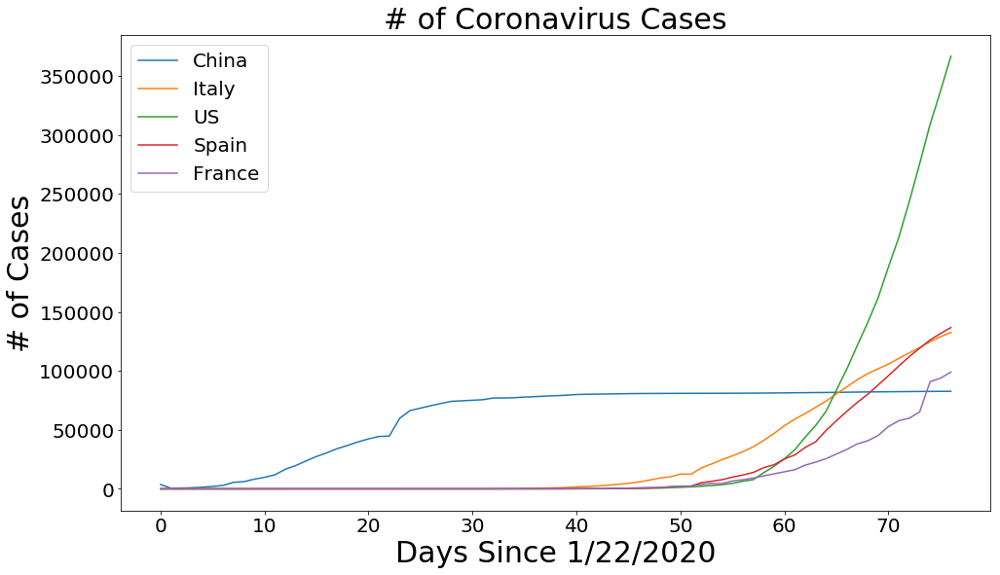

# [WIP] Covid-19: Visualisation, Spread Analysis, Modelling and Prediction

> Warning: this notebook is still work in progress, and I will keep adding different parts and updating with last COVID-19 Data. 

In this notebook, we will track the spread of the COVID-19 using different data visualisation technics. Then, we will try to model its spread using SEIR model and at the end we will try to predict its evolution in the near future. 

|  | 
|:--:| 
| *Source: https://www.statnews.com/wp-content/uploads/2020/02/Coronavirus-CDC-645x645.jpg* |

aaa

References:
https://www.kaggle.com/therealcyberlord/coronavirus-covid-19-visualization-prediction/#data

https://www.kaggle.com/tarunkr/covid-19-case-study-analysis-viz-comparisons

https://www.kaggle.com/saga21/covid-global-forecast-sir-model-ml-regressions

https://www.kaggle.com/anjum48/seir-hcd-model

#### Import Packages


```python
!pip install 'pycountry_convert' 
```

    Requirement already satisfied: pycountry_convert in /opt/conda/lib/python3.6/site-packages (0.7.2)
    Requirement already satisfied: pycountry>=16.11.27.1 in /opt/conda/lib/python3.6/site-packages (from pycountry_convert) (19.8.18)
    Requirement already satisfied: repoze.lru>=0.7 in /opt/conda/lib/python3.6/site-packages (from pycountry_convert) (0.7)
    Requirement already satisfied: pytest-cov>=2.5.1 in /opt/conda/lib/python3.6/site-packages (from pycountry_convert) (2.8.1)
    Requirement already satisfied: pytest-mock>=1.6.3 in /opt/conda/lib/python3.6/site-packages (from pycountry_convert) (2.0.0)
    Requirement already satisfied: pprintpp>=0.3.0 in /opt/conda/lib/python3.6/site-packages (from pycountry_convert) (0.4.0)
    Requirement already satisfied: pytest>=3.4.0 in /opt/conda/lib/python3.6/site-packages (from pycountry_convert) (5.0.1)
    Requirement already satisfied: wheel>=0.30.0 in /opt/conda/lib/python3.6/site-packages (from pycountry_convert) (0.34.2)
    Requirement already satisfied: coverage>=4.4 in /opt/conda/lib/python3.6/site-packages (from pytest-cov>=2.5.1->pycountry_convert) (5.0.3)
    Requirement already satisfied: py>=1.5.0 in /opt/conda/lib/python3.6/site-packages (from pytest>=3.4.0->pycountry_convert) (1.8.1)
    Requirement already satisfied: packaging in /opt/conda/lib/python3.6/site-packages (from pytest>=3.4.0->pycountry_convert) (20.1)
    Requirement already satisfied: attrs>=17.4.0 in /opt/conda/lib/python3.6/site-packages (from pytest>=3.4.0->pycountry_convert) (19.3.0)
    Requirement already satisfied: more-itertools>=4.0.0 in /opt/conda/lib/python3.6/site-packages (from pytest>=3.4.0->pycountry_convert) (8.2.0)
    Requirement already satisfied: atomicwrites>=1.0 in /opt/conda/lib/python3.6/site-packages (from pytest>=3.4.0->pycountry_convert) (1.3.0)
    Requirement already satisfied: pluggy<1.0,>=0.12 in /opt/conda/lib/python3.6/site-packages (from pytest>=3.4.0->pycountry_convert) (0.13.1)
    Requirement already satisfied: importlib-metadata>=0.12 in /opt/conda/lib/python3.6/site-packages (from pytest>=3.4.0->pycountry_convert) (1.5.0)
    Requirement already satisfied: wcwidth in /opt/conda/lib/python3.6/site-packages (from pytest>=3.4.0->pycountry_convert) (0.1.8)
    Requirement already satisfied: pyparsing>=2.0.2 in /opt/conda/lib/python3.6/site-packages (from packaging->pytest>=3.4.0->pycountry_convert) (2.4.6)
    Requirement already satisfied: six in /opt/conda/lib/python3.6/site-packages (from packaging->pytest>=3.4.0->pycountry_convert) (1.14.0)
    Requirement already satisfied: zipp>=0.5 in /opt/conda/lib/python3.6/site-packages (from importlib-metadata>=0.12->pytest>=3.4.0->pycountry_convert) (2.2.0)


```python
import numpy as np 
import pandas as pd 
import matplotlib.pyplot as plt
import seaborn as sns
import pycountry_convert as pc

import warnings
warnings.filterwarnings('ignore')
```

# Preprocessing Data
<hr>

Data: https://github.com/CSSEGISandData/COVID-19 


```python
df_confirmed = pd.read_csv('https://raw.githubusercontent.com/CSSEGISandData/COVID-19/master/csse_covid_19_data/csse_covid_19_time_series/time_series_covid19_confirmed_global.csv')
df_deaths = pd.read_csv('https://raw.githubusercontent.com/CSSEGISandData/COVID-19/master/csse_covid_19_data/csse_covid_19_time_series/time_series_covid19_deaths_global.csv')
df_recoveries = pd.read_csv('https://raw.githubusercontent.com/CSSEGISandData/COVID-19/master/csse_covid_19_data/csse_covid_19_time_series/time_series_covid19_recovered_global.csv')
latest_data = pd.read_csv('https://raw.githubusercontent.com/CSSEGISandData/COVID-19/master/csse_covid_19_data/csse_covid_19_daily_reports/03-30-2020.csv')
```


```python
latest_data.head()
```


<div>
<style scoped>
    .dataframe tbody tr th:only-of-type {
        vertical-align: middle;
    }

    .dataframe tbody tr th {
        vertical-align: top;
    }

    .dataframe thead th {
        text-align: right;
    }
</style>
<table border="1" class="dataframe">
  <thead>
    <tr style="text-align: right;">
      <th></th>
      <th>FIPS</th>
      <th>Admin2</th>
      <th>Province_State</th>
      <th>Country_Region</th>
      <th>Last_Update</th>
      <th>Lat</th>
      <th>Long_</th>
      <th>Confirmed</th>
      <th>Deaths</th>
      <th>Recovered</th>
      <th>Active</th>
      <th>Combined_Key</th>
    </tr>
  </thead>
  <tbody>
    <tr>
      <th>0</th>
      <td>45001.0</td>
      <td>Abbeville</td>
      <td>South Carolina</td>
      <td>US</td>
      <td>2020-03-30 22:52:45</td>
      <td>34.223334</td>
      <td>-82.461707</td>
      <td>3</td>
      <td>0</td>
      <td>0</td>
      <td>0</td>
      <td>Abbeville, South Carolina, US</td>
    </tr>
    <tr>
      <th>1</th>
      <td>22001.0</td>
      <td>Acadia</td>
      <td>Louisiana</td>
      <td>US</td>
      <td>2020-03-30 22:52:45</td>
      <td>30.295065</td>
      <td>-92.414197</td>
      <td>11</td>
      <td>1</td>
      <td>0</td>
      <td>0</td>
      <td>Acadia, Louisiana, US</td>
    </tr>
    <tr>
      <th>2</th>
      <td>51001.0</td>
      <td>Accomack</td>
      <td>Virginia</td>
      <td>US</td>
      <td>2020-03-30 22:52:45</td>
      <td>37.767072</td>
      <td>-75.632346</td>
      <td>6</td>
      <td>0</td>
      <td>0</td>
      <td>0</td>
      <td>Accomack, Virginia, US</td>
    </tr>
    <tr>
      <th>3</th>
      <td>16001.0</td>
      <td>Ada</td>
      <td>Idaho</td>
      <td>US</td>
      <td>2020-03-30 22:52:45</td>
      <td>43.452658</td>
      <td>-116.241552</td>
      <td>113</td>
      <td>2</td>
      <td>0</td>
      <td>0</td>
      <td>Ada, Idaho, US</td>
    </tr>
    <tr>
      <th>4</th>
      <td>19001.0</td>
      <td>Adair</td>
      <td>Iowa</td>
      <td>US</td>
      <td>2020-03-30 22:52:45</td>
      <td>41.330756</td>
      <td>-94.471059</td>
      <td>1</td>
      <td>0</td>
      <td>0</td>
      <td>0</td>
      <td>Adair, Iowa, US</td>
    </tr>
  </tbody>
</table>
</div>


```python
df_confirmed.head()
```


<div>
<style scoped>
    .dataframe tbody tr th:only-of-type {
        vertical-align: middle;
    }

    .dataframe tbody tr th {
        vertical-align: top;
    }

    .dataframe thead th {
        text-align: right;
    }
</style>
<table border="1" class="dataframe">
  <thead>
    <tr style="text-align: right;">
      <th></th>
      <th>Province/State</th>
      <th>Country/Region</th>
      <th>Lat</th>
      <th>Long</th>
      <th>1/22/20</th>
      <th>1/23/20</th>
      <th>1/24/20</th>
      <th>1/25/20</th>
      <th>1/26/20</th>
      <th>1/27/20</th>
      <th>...</th>
      <th>3/28/20</th>
      <th>3/29/20</th>
      <th>3/30/20</th>
      <th>3/31/20</th>
      <th>4/1/20</th>
      <th>4/2/20</th>
      <th>4/3/20</th>
      <th>4/4/20</th>
      <th>4/5/20</th>
      <th>4/6/20</th>
    </tr>
  </thead>
  <tbody>
    <tr>
      <th>0</th>
      <td>NaN</td>
      <td>Afghanistan</td>
      <td>33.0000</td>
      <td>65.0000</td>
      <td>0</td>
      <td>0</td>
      <td>0</td>
      <td>0</td>
      <td>0</td>
      <td>0</td>
      <td>...</td>
      <td>110</td>
      <td>120</td>
      <td>170</td>
      <td>174</td>
      <td>237</td>
      <td>273</td>
      <td>281</td>
      <td>299</td>
      <td>349</td>
      <td>367</td>
    </tr>
    <tr>
      <th>1</th>
      <td>NaN</td>
      <td>Albania</td>
      <td>41.1533</td>
      <td>20.1683</td>
      <td>0</td>
      <td>0</td>
      <td>0</td>
      <td>0</td>
      <td>0</td>
      <td>0</td>
      <td>...</td>
      <td>197</td>
      <td>212</td>
      <td>223</td>
      <td>243</td>
      <td>259</td>
      <td>277</td>
      <td>304</td>
      <td>333</td>
      <td>361</td>
      <td>377</td>
    </tr>
    <tr>
      <th>2</th>
      <td>NaN</td>
      <td>Algeria</td>
      <td>28.0339</td>
      <td>1.6596</td>
      <td>0</td>
      <td>0</td>
      <td>0</td>
      <td>0</td>
      <td>0</td>
      <td>0</td>
      <td>...</td>
      <td>454</td>
      <td>511</td>
      <td>584</td>
      <td>716</td>
      <td>847</td>
      <td>986</td>
      <td>1171</td>
      <td>1251</td>
      <td>1320</td>
      <td>1423</td>
    </tr>
    <tr>
      <th>3</th>
      <td>NaN</td>
      <td>Andorra</td>
      <td>42.5063</td>
      <td>1.5218</td>
      <td>0</td>
      <td>0</td>
      <td>0</td>
      <td>0</td>
      <td>0</td>
      <td>0</td>
      <td>...</td>
      <td>308</td>
      <td>334</td>
      <td>370</td>
      <td>376</td>
      <td>390</td>
      <td>428</td>
      <td>439</td>
      <td>466</td>
      <td>501</td>
      <td>525</td>
    </tr>
    <tr>
      <th>4</th>
      <td>NaN</td>
      <td>Angola</td>
      <td>-11.2027</td>
      <td>17.8739</td>
      <td>0</td>
      <td>0</td>
      <td>0</td>
      <td>0</td>
      <td>0</td>
      <td>0</td>
      <td>...</td>
      <td>5</td>
      <td>7</td>
      <td>7</td>
      <td>7</td>
      <td>8</td>
      <td>8</td>
      <td>8</td>
      <td>10</td>
      <td>14</td>
      <td>16</td>
    </tr>
  </tbody>
</table>
<p>5 rows × 80 columns</p>
</div>


```python
df_deaths.head()
```


<div>
<style scoped>
    .dataframe tbody tr th:only-of-type {
        vertical-align: middle;
    }

    .dataframe tbody tr th {
        vertical-align: top;
    }

    .dataframe thead th {
        text-align: right;
    }
</style>
<table border="1" class="dataframe">
  <thead>
    <tr style="text-align: right;">
      <th></th>
      <th>Province/State</th>
      <th>Country/Region</th>
      <th>Lat</th>
      <th>Long</th>
      <th>1/22/20</th>
      <th>1/23/20</th>
      <th>1/24/20</th>
      <th>1/25/20</th>
      <th>1/26/20</th>
      <th>1/27/20</th>
      <th>...</th>
      <th>3/28/20</th>
      <th>3/29/20</th>
      <th>3/30/20</th>
      <th>3/31/20</th>
      <th>4/1/20</th>
      <th>4/2/20</th>
      <th>4/3/20</th>
      <th>4/4/20</th>
      <th>4/5/20</th>
      <th>4/6/20</th>
    </tr>
  </thead>
  <tbody>
    <tr>
      <th>0</th>
      <td>NaN</td>
      <td>Afghanistan</td>
      <td>33.0000</td>
      <td>65.0000</td>
      <td>0</td>
      <td>0</td>
      <td>0</td>
      <td>0</td>
      <td>0</td>
      <td>0</td>
      <td>...</td>
      <td>4</td>
      <td>4</td>
      <td>4</td>
      <td>4</td>
      <td>4</td>
      <td>6</td>
      <td>6</td>
      <td>7</td>
      <td>7</td>
      <td>11</td>
    </tr>
    <tr>
      <th>1</th>
      <td>NaN</td>
      <td>Albania</td>
      <td>41.1533</td>
      <td>20.1683</td>
      <td>0</td>
      <td>0</td>
      <td>0</td>
      <td>0</td>
      <td>0</td>
      <td>0</td>
      <td>...</td>
      <td>10</td>
      <td>10</td>
      <td>11</td>
      <td>15</td>
      <td>15</td>
      <td>16</td>
      <td>17</td>
      <td>20</td>
      <td>20</td>
      <td>21</td>
    </tr>
    <tr>
      <th>2</th>
      <td>NaN</td>
      <td>Algeria</td>
      <td>28.0339</td>
      <td>1.6596</td>
      <td>0</td>
      <td>0</td>
      <td>0</td>
      <td>0</td>
      <td>0</td>
      <td>0</td>
      <td>...</td>
      <td>29</td>
      <td>31</td>
      <td>35</td>
      <td>44</td>
      <td>58</td>
      <td>86</td>
      <td>105</td>
      <td>130</td>
      <td>152</td>
      <td>173</td>
    </tr>
    <tr>
      <th>3</th>
      <td>NaN</td>
      <td>Andorra</td>
      <td>42.5063</td>
      <td>1.5218</td>
      <td>0</td>
      <td>0</td>
      <td>0</td>
      <td>0</td>
      <td>0</td>
      <td>0</td>
      <td>...</td>
      <td>3</td>
      <td>6</td>
      <td>8</td>
      <td>12</td>
      <td>14</td>
      <td>15</td>
      <td>16</td>
      <td>17</td>
      <td>18</td>
      <td>21</td>
    </tr>
    <tr>
      <th>4</th>
      <td>NaN</td>
      <td>Angola</td>
      <td>-11.2027</td>
      <td>17.8739</td>
      <td>0</td>
      <td>0</td>
      <td>0</td>
      <td>0</td>
      <td>0</td>
      <td>0</td>
      <td>...</td>
      <td>0</td>
      <td>2</td>
      <td>2</td>
      <td>2</td>
      <td>2</td>
      <td>2</td>
      <td>2</td>
      <td>2</td>
      <td>2</td>
      <td>2</td>
    </tr>
  </tbody>
</table>
<p>5 rows × 80 columns</p>
</div>


```python
df_recoveries.head()
```


<div>
<style scoped>
    .dataframe tbody tr th:only-of-type {
        vertical-align: middle;
    }

    .dataframe tbody tr th {
        vertical-align: top;
    }

    .dataframe thead th {
        text-align: right;
    }
</style>
<table border="1" class="dataframe">
  <thead>
    <tr style="text-align: right;">
      <th></th>
      <th>Province/State</th>
      <th>Country/Region</th>
      <th>Lat</th>
      <th>Long</th>
      <th>1/22/20</th>
      <th>1/23/20</th>
      <th>1/24/20</th>
      <th>1/25/20</th>
      <th>1/26/20</th>
      <th>1/27/20</th>
      <th>...</th>
      <th>3/28/20</th>
      <th>3/29/20</th>
      <th>3/30/20</th>
      <th>3/31/20</th>
      <th>4/1/20</th>
      <th>4/2/20</th>
      <th>4/3/20</th>
      <th>4/4/20</th>
      <th>4/5/20</th>
      <th>4/6/20</th>
    </tr>
  </thead>
  <tbody>
    <tr>
      <th>0</th>
      <td>NaN</td>
      <td>Afghanistan</td>
      <td>33.0000</td>
      <td>65.0000</td>
      <td>0</td>
      <td>0</td>
      <td>0</td>
      <td>0</td>
      <td>0</td>
      <td>0</td>
      <td>...</td>
      <td>2</td>
      <td>2</td>
      <td>2</td>
      <td>5</td>
      <td>5</td>
      <td>10</td>
      <td>10</td>
      <td>10</td>
      <td>15</td>
      <td>18</td>
    </tr>
    <tr>
      <th>1</th>
      <td>NaN</td>
      <td>Albania</td>
      <td>41.1533</td>
      <td>20.1683</td>
      <td>0</td>
      <td>0</td>
      <td>0</td>
      <td>0</td>
      <td>0</td>
      <td>0</td>
      <td>...</td>
      <td>31</td>
      <td>33</td>
      <td>44</td>
      <td>52</td>
      <td>67</td>
      <td>76</td>
      <td>89</td>
      <td>99</td>
      <td>104</td>
      <td>116</td>
    </tr>
    <tr>
      <th>2</th>
      <td>NaN</td>
      <td>Algeria</td>
      <td>28.0339</td>
      <td>1.6596</td>
      <td>0</td>
      <td>0</td>
      <td>0</td>
      <td>0</td>
      <td>0</td>
      <td>0</td>
      <td>...</td>
      <td>31</td>
      <td>31</td>
      <td>37</td>
      <td>46</td>
      <td>61</td>
      <td>61</td>
      <td>62</td>
      <td>90</td>
      <td>90</td>
      <td>90</td>
    </tr>
    <tr>
      <th>3</th>
      <td>NaN</td>
      <td>Andorra</td>
      <td>42.5063</td>
      <td>1.5218</td>
      <td>0</td>
      <td>0</td>
      <td>0</td>
      <td>0</td>
      <td>0</td>
      <td>0</td>
      <td>...</td>
      <td>1</td>
      <td>1</td>
      <td>10</td>
      <td>10</td>
      <td>10</td>
      <td>10</td>
      <td>16</td>
      <td>21</td>
      <td>26</td>
      <td>31</td>
    </tr>
    <tr>
      <th>4</th>
      <td>NaN</td>
      <td>Angola</td>
      <td>-11.2027</td>
      <td>17.8739</td>
      <td>0</td>
      <td>0</td>
      <td>0</td>
      <td>0</td>
      <td>0</td>
      <td>0</td>
      <td>...</td>
      <td>0</td>
      <td>0</td>
      <td>0</td>
      <td>1</td>
      <td>1</td>
      <td>1</td>
      <td>1</td>
      <td>2</td>
      <td>2</td>
      <td>2</td>
    </tr>
  </tbody>
</table>
<p>5 rows × 80 columns</p>
</div>


```python
df_covid19 = pd.read_csv("https://raw.githubusercontent.com/CSSEGISandData/COVID-19/web-data/data/cases_country.csv")
df_table = pd.read_csv("https://raw.githubusercontent.com/CSSEGISandData/COVID-19/web-data/data/cases_time.csv",parse_dates=['Last_Update'])
```


```python
df_table.head()
```


<div>
<style scoped>
    .dataframe tbody tr th:only-of-type {
        vertical-align: middle;
    }

    .dataframe tbody tr th {
        vertical-align: top;
    }

    .dataframe thead th {
        text-align: right;
    }
</style>
<table border="1" class="dataframe">
  <thead>
    <tr style="text-align: right;">
      <th></th>
      <th>Country_Region</th>
      <th>Last_Update</th>
      <th>Confirmed</th>
      <th>Deaths</th>
      <th>Recovered</th>
      <th>Active</th>
      <th>Delta_Confirmed</th>
      <th>Delta_Recovered</th>
    </tr>
  </thead>
  <tbody>
    <tr>
      <th>0</th>
      <td>Afghanistan</td>
      <td>2020-01-22</td>
      <td>0</td>
      <td>0</td>
      <td>NaN</td>
      <td>NaN</td>
      <td>0</td>
      <td>NaN</td>
    </tr>
    <tr>
      <th>1</th>
      <td>Afghanistan</td>
      <td>2020-01-23</td>
      <td>0</td>
      <td>0</td>
      <td>NaN</td>
      <td>NaN</td>
      <td>0</td>
      <td>NaN</td>
    </tr>
    <tr>
      <th>2</th>
      <td>Afghanistan</td>
      <td>2020-01-24</td>
      <td>0</td>
      <td>0</td>
      <td>NaN</td>
      <td>NaN</td>
      <td>0</td>
      <td>NaN</td>
    </tr>
    <tr>
      <th>3</th>
      <td>Afghanistan</td>
      <td>2020-01-25</td>
      <td>0</td>
      <td>0</td>
      <td>NaN</td>
      <td>NaN</td>
      <td>0</td>
      <td>NaN</td>
    </tr>
    <tr>
      <th>4</th>
      <td>Afghanistan</td>
      <td>2020-01-26</td>
      <td>0</td>
      <td>0</td>
      <td>NaN</td>
      <td>NaN</td>
      <td>0</td>
      <td>NaN</td>
    </tr>
  </tbody>
</table>
</div>


```python
df_table.head()
```


<div>
<style scoped>
    .dataframe tbody tr th:only-of-type {
        vertical-align: middle;
    }

    .dataframe tbody tr th {
        vertical-align: top;
    }

    .dataframe thead th {
        text-align: right;
    }
</style>
<table border="1" class="dataframe">
  <thead>
    <tr style="text-align: right;">
      <th></th>
      <th>Country_Region</th>
      <th>Last_Update</th>
      <th>Confirmed</th>
      <th>Deaths</th>
      <th>Recovered</th>
      <th>Active</th>
      <th>Delta_Confirmed</th>
      <th>Delta_Recovered</th>
    </tr>
  </thead>
  <tbody>
    <tr>
      <th>0</th>
      <td>Afghanistan</td>
      <td>2020-01-22</td>
      <td>0</td>
      <td>0</td>
      <td>NaN</td>
      <td>NaN</td>
      <td>0</td>
      <td>NaN</td>
    </tr>
    <tr>
      <th>1</th>
      <td>Afghanistan</td>
      <td>2020-01-23</td>
      <td>0</td>
      <td>0</td>
      <td>NaN</td>
      <td>NaN</td>
      <td>0</td>
      <td>NaN</td>
    </tr>
    <tr>
      <th>2</th>
      <td>Afghanistan</td>
      <td>2020-01-24</td>
      <td>0</td>
      <td>0</td>
      <td>NaN</td>
      <td>NaN</td>
      <td>0</td>
      <td>NaN</td>
    </tr>
    <tr>
      <th>3</th>
      <td>Afghanistan</td>
      <td>2020-01-25</td>
      <td>0</td>
      <td>0</td>
      <td>NaN</td>
      <td>NaN</td>
      <td>0</td>
      <td>NaN</td>
    </tr>
    <tr>
      <th>4</th>
      <td>Afghanistan</td>
      <td>2020-01-26</td>
      <td>0</td>
      <td>0</td>
      <td>NaN</td>
      <td>NaN</td>
      <td>0</td>
      <td>NaN</td>
    </tr>
  </tbody>
</table>
</div>


```python
df_confirmed = df_confirmed.rename(columns={"Province/State":"state","Country/Region": "country"})
df_deaths = df_deaths.rename(columns={"Province/State":"state","Country/Region": "country"})
df_recoveries =  df_recoveries.rename(columns={"Province/State":"state","Country/Region": "country"})
df_covid19 = df_covid19.rename(columns={"Country_Region": "country"})
df_covid19["Active"] = df_covid19["Confirmed"]-df_covid19["Recovered"]-df_covid19["Deaths"]
```

### Loading continent using pycountry_convert library


```python
# Changing the country names as required by pycountry_convert Lib
df_confirmed.loc[df_confirmed['country'] == "US", "country"] = "USA"
df_deaths.loc[df_deaths['country'] == "US", "country"] = "USA"
df_covid19.loc[df_covid19['country'] == "US", "country"] = "USA"
df_table.loc[df_table['Country_Region'] == "US", "Country_Region"] = "USA"


df_confirmed.loc[df_confirmed['country'] == 'Korea, South', "country"] = 'South Korea'
df_deaths.loc[df_deaths['country'] == 'Korea, South', "country"] = 'South Korea'
df_covid19.loc[df_covid19['country'] == "Korea, South", "country"] = "South Korea"
df_table.loc[df_table['Country_Region'] == "Korea, South", "Country_Region"] = "South Korea"

df_confirmed.loc[df_confirmed['country'] == 'Taiwan*', "country"] = 'Taiwan'
df_deaths.loc[df_deaths['country'] == 'Taiwan*', "country"] = 'Taiwan'
df_covid19.loc[df_covid19['country'] == "Taiwan*", "country"] = "Taiwan"
df_table.loc[df_table['Country_Region'] == "Taiwan*", "Country_Region"] = "Taiwan"

df_confirmed.loc[df_confirmed['country'] == 'Congo (Kinshasa)', "country"] = 'Democratic Republic of the Congo'
df_deaths.loc[df_deaths['country'] == 'Congo (Kinshasa)', "country"] = 'Democratic Republic of the Congo'
df_covid19.loc[df_covid19['country'] == "Congo (Kinshasa)", "country"] = "Democratic Republic of the Congo"
df_table.loc[df_table['Country_Region'] == "Congo (Kinshasa)", "Country_Region"] = "Democratic Republic of the Congo"

df_confirmed.loc[df_confirmed['country'] == "Cote d'Ivoire", "country"] = "Côte d'Ivoire"
df_deaths.loc[df_deaths['country'] == "Cote d'Ivoire", "country"] = "Côte d'Ivoire"
df_covid19.loc[df_covid19['country'] == "Cote d'Ivoire", "country"] = "Côte d'Ivoire"
df_table.loc[df_table['Country_Region'] == "Cote d'Ivoire", "Country_Region"] = "Côte d'Ivoire"

df_confirmed.loc[df_confirmed['country'] == "Reunion", "country"] = "Réunion"
df_deaths.loc[df_deaths['country'] == "Reunion", "country"] = "Réunion"
df_covid19.loc[df_covid19['country'] == "Reunion", "country"] = "Réunion"
df_table.loc[df_table['Country_Region'] == "Reunion", "Country_Region"] = "Réunion"

df_confirmed.loc[df_confirmed['country'] == 'Congo (Brazzaville)', "country"] = 'Republic of the Congo'
df_deaths.loc[df_deaths['country'] == 'Congo (Brazzaville)', "country"] = 'Republic of the Congo'
df_covid19.loc[df_covid19['country'] == "Congo (Brazzaville)", "country"] = "Republic of the Congo"
df_table.loc[df_table['Country_Region'] == "Congo (Brazzaville)", "Country_Region"] = "Republic of the Congo"

df_confirmed.loc[df_confirmed['country'] == 'Bahamas, The', "country"] = 'Bahamas'
df_deaths.loc[df_deaths['country'] == 'Bahamas, The', "country"] = 'Bahamas'
df_covid19.loc[df_covid19['country'] == "Bahamas, The", "country"] = "Bahamas"
df_table.loc[df_table['Country_Region'] == "Bahamas, The", "Country_Region"] = "Bahamas"

df_confirmed.loc[df_confirmed['country'] == 'Gambia, The', "country"] = 'Gambia'
df_deaths.loc[df_deaths['country'] == 'Gambia, The', "country"] = 'Gambia'
df_covid19.loc[df_covid19['country'] == "Gambia, The", "country"] = "Gambia"
df_table.loc[df_table['Country_Region'] == "Gambia", "Country_Region"] = "Gambia"

# getting all countries
countries = np.asarray(df_confirmed["country"])
countries1 = np.asarray(df_covid19["country"])
# Continent_code to Continent_names
continents = {
    'NA': 'North America',
    'SA': 'South America', 
    'AS': 'Asia',
    'OC': 'Australia',
    'AF': 'Africa',
    'EU' : 'Europe',
    'na' : 'Others'
}

# Defininng Function for getting continent code for country.
def country_to_continent_code(country):
    try:
        return pc.country_alpha2_to_continent_code(pc.country_name_to_country_alpha2(country))
    except :
        return 'na'

#Collecting Continent Information
df_confirmed.insert(2,"continent", [continents[country_to_continent_code(country)] for country in countries[:]])
df_deaths.insert(2,"continent",  [continents[country_to_continent_code(country)] for country in countries[:]])
df_covid19.insert(1,"continent",  [continents[country_to_continent_code(country)] for country in countries1[:]])
df_table.insert(1,"continent",  [continents[country_to_continent_code(country)] for country in df_table["Country_Region"].values])
```


```python
df_table = df_table[df_table["continent"] != "Others"]
```


```python
# displaying countries from 'Others' continent
df_deaths[df_deaths["continent"]== 'Others']
```


<div>
<style scoped>
    .dataframe tbody tr th:only-of-type {
        vertical-align: middle;
    }

    .dataframe tbody tr th {
        vertical-align: top;
    }

    .dataframe thead th {
        text-align: right;
    }
</style>
<table border="1" class="dataframe">
  <thead>
    <tr style="text-align: right;">
      <th></th>
      <th>state</th>
      <th>country</th>
      <th>continent</th>
      <th>Lat</th>
      <th>Long</th>
      <th>1/22/20</th>
      <th>1/23/20</th>
      <th>1/24/20</th>
      <th>1/25/20</th>
      <th>1/26/20</th>
      <th>...</th>
      <th>3/28/20</th>
      <th>3/29/20</th>
      <th>3/30/20</th>
      <th>3/31/20</th>
      <th>4/1/20</th>
      <th>4/2/20</th>
      <th>4/3/20</th>
      <th>4/4/20</th>
      <th>4/5/20</th>
      <th>4/6/20</th>
    </tr>
  </thead>
  <tbody>
    <tr>
      <th>88</th>
      <td>NaN</td>
      <td>Diamond Princess</td>
      <td>Others</td>
      <td>0.000000</td>
      <td>0.000000</td>
      <td>0</td>
      <td>0</td>
      <td>0</td>
      <td>0</td>
      <td>0</td>
      <td>...</td>
      <td>10</td>
      <td>10</td>
      <td>10</td>
      <td>10</td>
      <td>11</td>
      <td>11</td>
      <td>11</td>
      <td>11</td>
      <td>11</td>
      <td>11</td>
    </tr>
    <tr>
      <th>127</th>
      <td>NaN</td>
      <td>Holy See</td>
      <td>Others</td>
      <td>41.902900</td>
      <td>12.453400</td>
      <td>0</td>
      <td>0</td>
      <td>0</td>
      <td>0</td>
      <td>0</td>
      <td>...</td>
      <td>0</td>
      <td>0</td>
      <td>0</td>
      <td>0</td>
      <td>0</td>
      <td>0</td>
      <td>0</td>
      <td>0</td>
      <td>0</td>
      <td>0</td>
    </tr>
    <tr>
      <th>236</th>
      <td>NaN</td>
      <td>Timor-Leste</td>
      <td>Others</td>
      <td>-8.874217</td>
      <td>125.727539</td>
      <td>0</td>
      <td>0</td>
      <td>0</td>
      <td>0</td>
      <td>0</td>
      <td>...</td>
      <td>0</td>
      <td>0</td>
      <td>0</td>
      <td>0</td>
      <td>0</td>
      <td>0</td>
      <td>0</td>
      <td>0</td>
      <td>0</td>
      <td>0</td>
    </tr>
    <tr>
      <th>241</th>
      <td>NaN</td>
      <td>West Bank and Gaza</td>
      <td>Others</td>
      <td>31.952200</td>
      <td>35.233200</td>
      <td>0</td>
      <td>0</td>
      <td>0</td>
      <td>0</td>
      <td>0</td>
      <td>...</td>
      <td>1</td>
      <td>1</td>
      <td>1</td>
      <td>1</td>
      <td>1</td>
      <td>1</td>
      <td>1</td>
      <td>1</td>
      <td>1</td>
      <td>1</td>
    </tr>
    <tr>
      <th>247</th>
      <td>NaN</td>
      <td>Kosovo</td>
      <td>Others</td>
      <td>42.602636</td>
      <td>20.902977</td>
      <td>0</td>
      <td>0</td>
      <td>0</td>
      <td>0</td>
      <td>0</td>
      <td>...</td>
      <td>1</td>
      <td>1</td>
      <td>1</td>
      <td>1</td>
      <td>1</td>
      <td>1</td>
      <td>1</td>
      <td>1</td>
      <td>1</td>
      <td>1</td>
    </tr>
    <tr>
      <th>248</th>
      <td>NaN</td>
      <td>Burma</td>
      <td>Others</td>
      <td>21.916200</td>
      <td>95.956000</td>
      <td>0</td>
      <td>0</td>
      <td>0</td>
      <td>0</td>
      <td>0</td>
      <td>...</td>
      <td>0</td>
      <td>0</td>
      <td>0</td>
      <td>1</td>
      <td>1</td>
      <td>1</td>
      <td>1</td>
      <td>1</td>
      <td>1</td>
      <td>1</td>
    </tr>
    <tr>
      <th>252</th>
      <td>NaN</td>
      <td>MS Zaandam</td>
      <td>Others</td>
      <td>0.000000</td>
      <td>0.000000</td>
      <td>0</td>
      <td>0</td>
      <td>0</td>
      <td>0</td>
      <td>0</td>
      <td>...</td>
      <td>0</td>
      <td>0</td>
      <td>0</td>
      <td>0</td>
      <td>2</td>
      <td>2</td>
      <td>2</td>
      <td>2</td>
      <td>2</td>
      <td>2</td>
    </tr>
    <tr>
      <th>261</th>
      <td>NaN</td>
      <td>Western Sahara</td>
      <td>Others</td>
      <td>24.215500</td>
      <td>-12.885800</td>
      <td>0</td>
      <td>0</td>
      <td>0</td>
      <td>0</td>
      <td>0</td>
      <td>...</td>
      <td>0</td>
      <td>0</td>
      <td>0</td>
      <td>0</td>
      <td>0</td>
      <td>0</td>
      <td>0</td>
      <td>0</td>
      <td>0</td>
      <td>0</td>
    </tr>
  </tbody>
</table>
<p>8 rows × 81 columns</p>
</div>


```python
print("Number of Country_Region: ", df_confirmed['country'].nunique())
print("Countries with Province/State informed: ", df_confirmed[df_confirmed['state'].isna()==False]['country'].unique())
```

    Number of Country_Region:  184
    Countries with Province/State informed:  ['Australia' 'Canada' 'China' 'Denmark' 'France' 'Netherlands'
     'United Kingdom']


```python
df_confirmed.loc[df_confirmed['country'] == 'United Kingdom']
```


<div>
<style scoped>
    .dataframe tbody tr th:only-of-type {
        vertical-align: middle;
    }

    .dataframe tbody tr th {
        vertical-align: top;
    }

    .dataframe thead th {
        text-align: right;
    }
</style>
<table border="1" class="dataframe">
  <thead>
    <tr style="text-align: right;">
      <th></th>
      <th>state</th>
      <th>country</th>
      <th>continent</th>
      <th>Lat</th>
      <th>Long</th>
      <th>1/22/20</th>
      <th>1/23/20</th>
      <th>1/24/20</th>
      <th>1/25/20</th>
      <th>1/26/20</th>
      <th>...</th>
      <th>3/28/20</th>
      <th>3/29/20</th>
      <th>3/30/20</th>
      <th>3/31/20</th>
      <th>4/1/20</th>
      <th>4/2/20</th>
      <th>4/3/20</th>
      <th>4/4/20</th>
      <th>4/5/20</th>
      <th>4/6/20</th>
    </tr>
  </thead>
  <tbody>
    <tr>
      <th>217</th>
      <td>Bermuda</td>
      <td>United Kingdom</td>
      <td>Europe</td>
      <td>32.3078</td>
      <td>-64.7505</td>
      <td>0</td>
      <td>0</td>
      <td>0</td>
      <td>0</td>
      <td>0</td>
      <td>...</td>
      <td>17</td>
      <td>22</td>
      <td>27</td>
      <td>32</td>
      <td>32</td>
      <td>35</td>
      <td>35</td>
      <td>35</td>
      <td>37</td>
      <td>39</td>
    </tr>
    <tr>
      <th>218</th>
      <td>Cayman Islands</td>
      <td>United Kingdom</td>
      <td>Europe</td>
      <td>19.3133</td>
      <td>-81.2546</td>
      <td>0</td>
      <td>0</td>
      <td>0</td>
      <td>0</td>
      <td>0</td>
      <td>...</td>
      <td>8</td>
      <td>8</td>
      <td>12</td>
      <td>14</td>
      <td>22</td>
      <td>28</td>
      <td>28</td>
      <td>35</td>
      <td>35</td>
      <td>39</td>
    </tr>
    <tr>
      <th>219</th>
      <td>Channel Islands</td>
      <td>United Kingdom</td>
      <td>Europe</td>
      <td>49.3723</td>
      <td>-2.3644</td>
      <td>0</td>
      <td>0</td>
      <td>0</td>
      <td>0</td>
      <td>0</td>
      <td>...</td>
      <td>97</td>
      <td>108</td>
      <td>141</td>
      <td>141</td>
      <td>172</td>
      <td>193</td>
      <td>232</td>
      <td>262</td>
      <td>309</td>
      <td>323</td>
    </tr>
    <tr>
      <th>220</th>
      <td>Gibraltar</td>
      <td>United Kingdom</td>
      <td>Europe</td>
      <td>36.1408</td>
      <td>-5.3536</td>
      <td>0</td>
      <td>0</td>
      <td>0</td>
      <td>0</td>
      <td>0</td>
      <td>...</td>
      <td>56</td>
      <td>65</td>
      <td>69</td>
      <td>69</td>
      <td>81</td>
      <td>88</td>
      <td>95</td>
      <td>98</td>
      <td>103</td>
      <td>109</td>
    </tr>
    <tr>
      <th>221</th>
      <td>Isle of Man</td>
      <td>United Kingdom</td>
      <td>Europe</td>
      <td>54.2361</td>
      <td>-4.5481</td>
      <td>0</td>
      <td>0</td>
      <td>0</td>
      <td>0</td>
      <td>0</td>
      <td>...</td>
      <td>32</td>
      <td>42</td>
      <td>49</td>
      <td>60</td>
      <td>68</td>
      <td>95</td>
      <td>114</td>
      <td>126</td>
      <td>127</td>
      <td>139</td>
    </tr>
    <tr>
      <th>222</th>
      <td>Montserrat</td>
      <td>United Kingdom</td>
      <td>Europe</td>
      <td>16.7425</td>
      <td>-62.1874</td>
      <td>0</td>
      <td>0</td>
      <td>0</td>
      <td>0</td>
      <td>0</td>
      <td>...</td>
      <td>5</td>
      <td>5</td>
      <td>5</td>
      <td>5</td>
      <td>5</td>
      <td>5</td>
      <td>6</td>
      <td>6</td>
      <td>6</td>
      <td>6</td>
    </tr>
    <tr>
      <th>223</th>
      <td>NaN</td>
      <td>United Kingdom</td>
      <td>Europe</td>
      <td>55.3781</td>
      <td>-3.4360</td>
      <td>0</td>
      <td>0</td>
      <td>0</td>
      <td>0</td>
      <td>0</td>
      <td>...</td>
      <td>17089</td>
      <td>19522</td>
      <td>22141</td>
      <td>25150</td>
      <td>29474</td>
      <td>33718</td>
      <td>38168</td>
      <td>41903</td>
      <td>47806</td>
      <td>51608</td>
    </tr>
    <tr>
      <th>249</th>
      <td>Anguilla</td>
      <td>United Kingdom</td>
      <td>Europe</td>
      <td>18.2206</td>
      <td>-63.0686</td>
      <td>0</td>
      <td>0</td>
      <td>0</td>
      <td>0</td>
      <td>0</td>
      <td>...</td>
      <td>2</td>
      <td>2</td>
      <td>2</td>
      <td>2</td>
      <td>2</td>
      <td>3</td>
      <td>3</td>
      <td>3</td>
      <td>3</td>
      <td>3</td>
    </tr>
    <tr>
      <th>250</th>
      <td>British Virgin Islands</td>
      <td>United Kingdom</td>
      <td>Europe</td>
      <td>18.4207</td>
      <td>-64.6400</td>
      <td>0</td>
      <td>0</td>
      <td>0</td>
      <td>0</td>
      <td>0</td>
      <td>...</td>
      <td>2</td>
      <td>2</td>
      <td>2</td>
      <td>3</td>
      <td>3</td>
      <td>3</td>
      <td>3</td>
      <td>3</td>
      <td>3</td>
      <td>3</td>
    </tr>
    <tr>
      <th>251</th>
      <td>Turks and Caicos Islands</td>
      <td>United Kingdom</td>
      <td>Europe</td>
      <td>21.6940</td>
      <td>-71.7979</td>
      <td>0</td>
      <td>0</td>
      <td>0</td>
      <td>0</td>
      <td>0</td>
      <td>...</td>
      <td>4</td>
      <td>4</td>
      <td>5</td>
      <td>5</td>
      <td>6</td>
      <td>5</td>
      <td>5</td>
      <td>5</td>
      <td>5</td>
      <td>8</td>
    </tr>
    <tr>
      <th>258</th>
      <td>Falkland Islands (Islas Malvinas)</td>
      <td>United Kingdom</td>
      <td>Europe</td>
      <td>-51.7963</td>
      <td>-59.5236</td>
      <td>0</td>
      <td>0</td>
      <td>0</td>
      <td>0</td>
      <td>0</td>
      <td>...</td>
      <td>0</td>
      <td>0</td>
      <td>0</td>
      <td>0</td>
      <td>0</td>
      <td>0</td>
      <td>0</td>
      <td>1</td>
      <td>2</td>
      <td>2</td>
    </tr>
  </tbody>
</table>
<p>11 rows × 81 columns</p>
</div>


```python
cols = df_confirmed.keys()
```


```python
# remove first 4 columns:	Province/State 	Country/Region 	Lat 	Long
confirmed = df_confirmed.loc[:, cols[4]:cols[-1]]
deaths = df_deaths.loc[:, cols[4]:cols[-1]]
recoveries = df_recoveries.loc[:, cols[4]:cols[-1]]
```


```python
dates = confirmed.keys()
world_cases = []
total_deaths = [] 
mortality_rate = []
recovery_rate = [] 
total_recovered = [] 
total_active = [] 
china_cases = [] 
italy_cases = []
us_cases = [] 
spain_cases = [] 
france_cases = []

for i in dates:
    confirmed_sum = confirmed[i].sum()
    death_sum = deaths[i].sum()
    recovered_sum = recoveries[i].sum()
    
    # confirmed, deaths, recovered, and active
    world_cases.append(confirmed_sum)
    total_deaths.append(death_sum)
    total_recovered.append(recovered_sum)
    total_active.append(confirmed_sum-death_sum-recovered_sum)
    
    # calculate rates
    mortality_rate.append(death_sum/confirmed_sum)
    recovery_rate.append(recovered_sum/confirmed_sum)

    # case studies 
    china_cases.append(df_confirmed[df_confirmed['country']=='China'][i].sum())
    italy_cases.append(df_confirmed[df_confirmed['country']=='Italy'][i].sum())
    us_cases.append(df_confirmed[df_confirmed['country']=='USA'][i].sum())
    spain_cases.append(df_confirmed[df_confirmed['country']=='Spain'][i].sum())
    france_cases.append(df_confirmed[df_confirmed['country']=='France'][i].sum())
```


```python
adjusted_dates = np.array([i for i in range(len(dates))]).reshape(-1, 1)[:,0]
plt.figure(figsize=(16, 9))
plt.plot(adjusted_dates, world_cases)
plt.title('# of Coronavirus Cases Over Time', size=30)
plt.xlabel('Days Since 1/22/2020', size=30)
plt.ylabel('# of Cases', size=30)
plt.xticks(size=20)
plt.yticks(size=20)
plt.show()
```


```python
plt.figure(figsize=(16, 9))
plt.plot(adjusted_dates, np.log10(world_cases))
plt.title('Log of # of Coronavirus Cases Over Time', size=30)
plt.xlabel('Days Since 1/22/2020', size=30)
plt.ylabel('# of Cases', size=30)
plt.xticks(size=20)
plt.yticks(size=20)
plt.show()
```


```python
df_countries_cases = df_covid19.copy().drop(['Lat','Long_','continent','Last_Update'],axis =1)
df_countries_cases.index = df_countries_cases["country"]
df_countries_cases = df_countries_cases.drop(['country'],axis=1)

df_continents_cases = df_covid19.copy().drop(['Lat','Long_','country','Last_Update'],axis =1)
df_continents_cases = df_continents_cases.groupby(["continent"]).sum()
```

### Global reported cases:


```python
df_t = pd.DataFrame(pd.to_numeric(df_countries_cases.sum()),dtype=np.float64).transpose()
df_t["Mortality Rate (per 100)"] = np.round(100*df_t["Deaths"]/df_t["Confirmed"],2)
df_t.style.background_gradient(cmap='Wistia',axis=1).format("{:.0f}",subset=["Confirmed"])
```


<style  type="text/css" >
    #T_3b593246_78e3_11ea_9fe4_a13aa3d552ecrow0_col0 {
            background-color:  #fc7f00;
            color:  #000000;
        }    #T_3b593246_78e3_11ea_9fe4_a13aa3d552ecrow0_col1 {
            background-color:  #eafa65;
            color:  #000000;
        }    #T_3b593246_78e3_11ea_9fe4_a13aa3d552ecrow0_col2 {
            background-color:  #fbec29;
            color:  #000000;
        }    #T_3b593246_78e3_11ea_9fe4_a13aa3d552ecrow0_col3 {
            background-color:  #ffa200;
            color:  #000000;
        }    #T_3b593246_78e3_11ea_9fe4_a13aa3d552ecrow0_col4 {
            background-color:  #e4ff7a;
            color:  #000000;
        }</style><table id="T_3b593246_78e3_11ea_9fe4_a13aa3d552ec" ><thead>    <tr>        <th class="blank level0" ></th>        <th class="col_heading level0 col0" >Confirmed</th>        <th class="col_heading level0 col1" >Deaths</th>        <th class="col_heading level0 col2" >Recovered</th>        <th class="col_heading level0 col3" >Active</th>        <th class="col_heading level0 col4" >Mortality Rate (per 100)</th>    </tr></thead><tbody>
                <tr>
                        <th id="T_3b593246_78e3_11ea_9fe4_a13aa3d552eclevel0_row0" class="row_heading level0 row0" >0</th>
                        <td id="T_3b593246_78e3_11ea_9fe4_a13aa3d552ecrow0_col0" class="data row0 col0" >1363365</td>
                        <td id="T_3b593246_78e3_11ea_9fe4_a13aa3d552ecrow0_col1" class="data row0 col1" >76420</td>
                        <td id="T_3b593246_78e3_11ea_9fe4_a13aa3d552ecrow0_col2" class="data row0 col2" >292425</td>
                        <td id="T_3b593246_78e3_11ea_9fe4_a13aa3d552ecrow0_col3" class="data row0 col3" >994520</td>
                        <td id="T_3b593246_78e3_11ea_9fe4_a13aa3d552ecrow0_col4" class="data row0 col4" >5.61</td>
            </tr>
    </tbody></table>


### Continent wise reported cases:


```python
df_continents_cases["Mortality Rate (per 100)"] = np.round(100*df_continents_cases["Deaths"]/df_continents_cases["Confirmed"],2)
df_continents_cases.style.background_gradient(cmap='Blues',subset=["Confirmed"])\
                        .background_gradient(cmap='Reds',subset=["Deaths"])\
                        .background_gradient(cmap='Greens',subset=["Recovered"])\
                        .background_gradient(cmap='Purples',subset=["Active"])\
                        .background_gradient(cmap='YlOrBr',subset=["Mortality Rate (per 100)"])
```


<style  type="text/css" >
    #T_69cb1540_78e3_11ea_9fe4_a13aa3d552ecrow0_col0 {
            background-color:  #f5f9fe;
            color:  #000000;
        }    #T_69cb1540_78e3_11ea_9fe4_a13aa3d552ecrow0_col1 {
            background-color:  #fff4ee;
            color:  #000000;
        }    #T_69cb1540_78e3_11ea_9fe4_a13aa3d552ecrow0_col2 {
            background-color:  #f7fcf5;
            color:  #000000;
        }    #T_69cb1540_78e3_11ea_9fe4_a13aa3d552ecrow0_col3 {
            background-color:  #faf9fc;
            color:  #000000;
        }    #T_69cb1540_78e3_11ea_9fe4_a13aa3d552ecrow0_col4 {
            background-color:  #f27f1b;
            color:  #000000;
        }    #T_69cb1540_78e3_11ea_9fe4_a13aa3d552ecrow1_col0 {
            background-color:  #a8cee4;
            color:  #000000;
        }    #T_69cb1540_78e3_11ea_9fe4_a13aa3d552ecrow1_col1 {
            background-color:  #fdd3c1;
            color:  #000000;
        }    #T_69cb1540_78e3_11ea_9fe4_a13aa3d552ecrow1_col2 {
            background-color:  #097532;
            color:  #f1f1f1;
        }    #T_69cb1540_78e3_11ea_9fe4_a13aa3d552ecrow1_col3 {
            background-color:  #dfdfed;
            color:  #000000;
        }    #T_69cb1540_78e3_11ea_9fe4_a13aa3d552ecrow1_col4 {
            background-color:  #fead3a;
            color:  #000000;
        }    #T_69cb1540_78e3_11ea_9fe4_a13aa3d552ecrow2_col0 {
            background-color:  #f5fafe;
            color:  #000000;
        }    #T_69cb1540_78e3_11ea_9fe4_a13aa3d552ecrow2_col1 {
            background-color:  #fff5f0;
            color:  #000000;
        }    #T_69cb1540_78e3_11ea_9fe4_a13aa3d552ecrow2_col2 {
            background-color:  #f6fcf4;
            color:  #000000;
        }    #T_69cb1540_78e3_11ea_9fe4_a13aa3d552ecrow2_col3 {
            background-color:  #fbfafc;
            color:  #000000;
        }    #T_69cb1540_78e3_11ea_9fe4_a13aa3d552ecrow2_col4 {
            background-color:  #ffffe5;
            color:  #000000;
        }    #T_69cb1540_78e3_11ea_9fe4_a13aa3d552ecrow3_col0 {
            background-color:  #08306b;
            color:  #f1f1f1;
        }    #T_69cb1540_78e3_11ea_9fe4_a13aa3d552ecrow3_col1 {
            background-color:  #67000d;
            color:  #f1f1f1;
        }    #T_69cb1540_78e3_11ea_9fe4_a13aa3d552ecrow3_col2 {
            background-color:  #00441b;
            color:  #f1f1f1;
        }    #T_69cb1540_78e3_11ea_9fe4_a13aa3d552ecrow3_col3 {
            background-color:  #3f007d;
            color:  #f1f1f1;
        }    #T_69cb1540_78e3_11ea_9fe4_a13aa3d552ecrow3_col4 {
            background-color:  #662506;
            color:  #f1f1f1;
        }    #T_69cb1540_78e3_11ea_9fe4_a13aa3d552ecrow4_col0 {
            background-color:  #539ecd;
            color:  #000000;
        }    #T_69cb1540_78e3_11ea_9fe4_a13aa3d552ecrow4_col1 {
            background-color:  #fdc5ae;
            color:  #000000;
        }    #T_69cb1540_78e3_11ea_9fe4_a13aa3d552ecrow4_col2 {
            background-color:  #dbf1d6;
            color:  #000000;
        }    #T_69cb1540_78e3_11ea_9fe4_a13aa3d552ecrow4_col3 {
            background-color:  #6e58a7;
            color:  #f1f1f1;
        }    #T_69cb1540_78e3_11ea_9fe4_a13aa3d552ecrow4_col4 {
            background-color:  #fed26d;
            color:  #000000;
        }    #T_69cb1540_78e3_11ea_9fe4_a13aa3d552ecrow5_col0 {
            background-color:  #f7fbff;
            color:  #000000;
        }    #T_69cb1540_78e3_11ea_9fe4_a13aa3d552ecrow5_col1 {
            background-color:  #fff5f0;
            color:  #000000;
        }    #T_69cb1540_78e3_11ea_9fe4_a13aa3d552ecrow5_col2 {
            background-color:  #f7fcf5;
            color:  #000000;
        }    #T_69cb1540_78e3_11ea_9fe4_a13aa3d552ecrow5_col3 {
            background-color:  #fcfbfd;
            color:  #000000;
        }    #T_69cb1540_78e3_11ea_9fe4_a13aa3d552ecrow5_col4 {
            background-color:  #fff9c5;
            color:  #000000;
        }    #T_69cb1540_78e3_11ea_9fe4_a13aa3d552ecrow6_col0 {
            background-color:  #f0f6fd;
            color:  #000000;
        }    #T_69cb1540_78e3_11ea_9fe4_a13aa3d552ecrow6_col1 {
            background-color:  #fff2ec;
            color:  #000000;
        }    #T_69cb1540_78e3_11ea_9fe4_a13aa3d552ecrow6_col2 {
            background-color:  #f5fbf3;
            color:  #000000;
        }    #T_69cb1540_78e3_11ea_9fe4_a13aa3d552ecrow6_col3 {
            background-color:  #f7f6fa;
            color:  #000000;
        }    #T_69cb1540_78e3_11ea_9fe4_a13aa3d552ecrow6_col4 {
            background-color:  #feb340;
            color:  #000000;
        }</style><table id="T_69cb1540_78e3_11ea_9fe4_a13aa3d552ec" ><thead>    <tr>        <th class="blank level0" ></th>        <th class="col_heading level0 col0" >Confirmed</th>        <th class="col_heading level0 col1" >Deaths</th>        <th class="col_heading level0 col2" >Recovered</th>        <th class="col_heading level0 col3" >Active</th>        <th class="col_heading level0 col4" >Mortality Rate (per 100)</th>    </tr>    <tr>        <th class="index_name level0" >continent</th>        <th class="blank" ></th>        <th class="blank" ></th>        <th class="blank" ></th>        <th class="blank" ></th>        <th class="blank" ></th>    </tr></thead><tbody>
                <tr>
                        <th id="T_69cb1540_78e3_11ea_9fe4_a13aa3d552eclevel0_row0" class="row_heading level0 row0" >Africa</th>
                        <td id="T_69cb1540_78e3_11ea_9fe4_a13aa3d552ecrow0_col0" class="data row0 col0" >10141</td>
                        <td id="T_69cb1540_78e3_11ea_9fe4_a13aa3d552ecrow0_col1" class="data row0 col1" >491</td>
                        <td id="T_69cb1540_78e3_11ea_9fe4_a13aa3d552ecrow0_col2" class="data row0 col2" >1007</td>
                        <td id="T_69cb1540_78e3_11ea_9fe4_a13aa3d552ecrow0_col3" class="data row0 col3" >8643</td>
                        <td id="T_69cb1540_78e3_11ea_9fe4_a13aa3d552ecrow0_col4" class="data row0 col4" >4.84</td>
            </tr>
            <tr>
                        <th id="T_69cb1540_78e3_11ea_9fe4_a13aa3d552eclevel0_row1" class="row_heading level0 row1" >Asia</th>
                        <td id="T_69cb1540_78e3_11ea_9fe4_a13aa3d552ecrow1_col0" class="data row1 col0" >237656</td>
                        <td id="T_69cb1540_78e3_11ea_9fe4_a13aa3d552ecrow1_col1" class="data row1 col1" >9122</td>
                        <td id="T_69cb1540_78e3_11ea_9fe4_a13aa3d552ecrow1_col2" class="data row1 col2" >120171</td>
                        <td id="T_69cb1540_78e3_11ea_9fe4_a13aa3d552ecrow1_col3" class="data row1 col3" >108363</td>
                        <td id="T_69cb1540_78e3_11ea_9fe4_a13aa3d552ecrow1_col4" class="data row1 col4" >3.84</td>
            </tr>
            <tr>
                        <th id="T_69cb1540_78e3_11ea_9fe4_a13aa3d552eclevel0_row2" class="row_heading level0 row2" >Australia</th>
                        <td id="T_69cb1540_78e3_11ea_9fe4_a13aa3d552ecrow2_col0" class="data row2 col0" >7072</td>
                        <td id="T_69cb1540_78e3_11ea_9fe4_a13aa3d552ecrow2_col1" class="data row2 col1" >46</td>
                        <td id="T_69cb1540_78e3_11ea_9fe4_a13aa3d552ecrow2_col2" class="data row2 col2" >1321</td>
                        <td id="T_69cb1540_78e3_11ea_9fe4_a13aa3d552ecrow2_col3" class="data row2 col3" >5705</td>
                        <td id="T_69cb1540_78e3_11ea_9fe4_a13aa3d552ecrow2_col4" class="data row2 col4" >0.65</td>
            </tr>
            <tr>
                        <th id="T_69cb1540_78e3_11ea_9fe4_a13aa3d552eclevel0_row3" class="row_heading level0 row3" >Europe</th>
                        <td id="T_69cb1540_78e3_11ea_9fe4_a13aa3d552ecrow3_col0" class="data row3 col0" >686614</td>
                        <td id="T_69cb1540_78e3_11ea_9fe4_a13aa3d552ecrow3_col1" class="data row3 col1" >54063</td>
                        <td id="T_69cb1540_78e3_11ea_9fe4_a13aa3d552ecrow3_col2" class="data row3 col2" >142317</td>
                        <td id="T_69cb1540_78e3_11ea_9fe4_a13aa3d552ecrow3_col3" class="data row3 col3" >490234</td>
                        <td id="T_69cb1540_78e3_11ea_9fe4_a13aa3d552ecrow3_col4" class="data row3 col4" >7.87</td>
            </tr>
            <tr>
                        <th id="T_69cb1540_78e3_11ea_9fe4_a13aa3d552eclevel0_row4" class="row_heading level0 row4" >North America</th>
                        <td id="T_69cb1540_78e3_11ea_9fe4_a13aa3d552ecrow4_col0" class="data row4 col0" >393222</td>
                        <td id="T_69cb1540_78e3_11ea_9fe4_a13aa3d552ecrow4_col1" class="data row4 col1" >11658</td>
                        <td id="T_69cb1540_78e3_11ea_9fe4_a13aa3d552ecrow4_col2" class="data row4 col2" >24352</td>
                        <td id="T_69cb1540_78e3_11ea_9fe4_a13aa3d552ecrow4_col3" class="data row4 col3" >357212</td>
                        <td id="T_69cb1540_78e3_11ea_9fe4_a13aa3d552ecrow4_col4" class="data row4 col4" >2.96</td>
            </tr>
            <tr>
                        <th id="T_69cb1540_78e3_11ea_9fe4_a13aa3d552eclevel0_row5" class="row_heading level0 row5" >Others</th>
                        <td id="T_69cb1540_78e3_11ea_9fe4_a13aa3d552ecrow5_col0" class="data row5 col0" >1160</td>
                        <td id="T_69cb1540_78e3_11ea_9fe4_a13aa3d552ecrow5_col1" class="data row5 col1" >16</td>
                        <td id="T_69cb1540_78e3_11ea_9fe4_a13aa3d552ecrow5_col2" class="data row5 col2" >666</td>
                        <td id="T_69cb1540_78e3_11ea_9fe4_a13aa3d552ecrow5_col3" class="data row5 col3" >478</td>
                        <td id="T_69cb1540_78e3_11ea_9fe4_a13aa3d552ecrow5_col4" class="data row5 col4" >1.38</td>
            </tr>
            <tr>
                        <th id="T_69cb1540_78e3_11ea_9fe4_a13aa3d552eclevel0_row6" class="row_heading level0 row6" >South America</th>
                        <td id="T_69cb1540_78e3_11ea_9fe4_a13aa3d552ecrow6_col0" class="data row6 col0" >27500</td>
                        <td id="T_69cb1540_78e3_11ea_9fe4_a13aa3d552ecrow6_col1" class="data row6 col1" >1024</td>
                        <td id="T_69cb1540_78e3_11ea_9fe4_a13aa3d552ecrow6_col2" class="data row6 col2" >2591</td>
                        <td id="T_69cb1540_78e3_11ea_9fe4_a13aa3d552ecrow6_col3" class="data row6 col3" >23885</td>
                        <td id="T_69cb1540_78e3_11ea_9fe4_a13aa3d552ecrow6_col4" class="data row6 col4" >3.72</td>
            </tr>
    </tbody></table>


### Country wise reported cases (top 20):


```python
df_countries_cases["Mortality Rate (per 100)"] = np.round(100*df_countries_cases["Deaths"]/df_countries_cases["Confirmed"],2)
df_countries_cases.sort_values('Confirmed', ascending= False).head(20).style.background_gradient(cmap='Blues',subset=["Confirmed"])\
                        .background_gradient(cmap='Reds',subset=["Deaths"])\
                        .background_gradient(cmap='Greens',subset=["Recovered"])\
                        .background_gradient(cmap='Purples',subset=["Active"])\
                        .background_gradient(cmap='YlOrBr',subset=["Mortality Rate (per 100)"])
```


<style  type="text/css" >
    #T_e023c7dc_78e3_11ea_9fe4_a13aa3d552ecrow0_col0 {
            background-color:  #08306b;
            color:  #f1f1f1;
        }    #T_e023c7dc_78e3_11ea_9fe4_a13aa3d552ecrow0_col1 {
            background-color:  #e32f27;
            color:  #f1f1f1;
        }    #T_e023c7dc_78e3_11ea_9fe4_a13aa3d552ecrow0_col2 {
            background-color:  #c6e8bf;
            color:  #000000;
        }    #T_e023c7dc_78e3_11ea_9fe4_a13aa3d552ecrow0_col3 {
            background-color:  #3f007d;
            color:  #f1f1f1;
        }    #T_e023c7dc_78e3_11ea_9fe4_a13aa3d552ecrow0_col4 {
            background-color:  #feeca4;
            color:  #000000;
        }    #T_e023c7dc_78e3_11ea_9fe4_a13aa3d552ecrow1_col0 {
            background-color:  #a0cbe2;
            color:  #000000;
        }    #T_e023c7dc_78e3_11ea_9fe4_a13aa3d552ecrow1_col1 {
            background-color:  #b11218;
            color:  #f1f1f1;
        }    #T_e023c7dc_78e3_11ea_9fe4_a13aa3d552ecrow1_col2 {
            background-color:  #5db96b;
            color:  #000000;
        }    #T_e023c7dc_78e3_11ea_9fe4_a13aa3d552ecrow1_col3 {
            background-color:  #dbdbec;
            color:  #000000;
        }    #T_e023c7dc_78e3_11ea_9fe4_a13aa3d552ecrow1_col4 {
            background-color:  #c14702;
            color:  #f1f1f1;
        }    #T_e023c7dc_78e3_11ea_9fe4_a13aa3d552ecrow2_col0 {
            background-color:  #a8cee4;
            color:  #000000;
        }    #T_e023c7dc_78e3_11ea_9fe4_a13aa3d552ecrow2_col1 {
            background-color:  #67000d;
            color:  #f1f1f1;
        }    #T_e023c7dc_78e3_11ea_9fe4_a13aa3d552ecrow2_col2 {
            background-color:  #bae3b3;
            color:  #000000;
        }    #T_e023c7dc_78e3_11ea_9fe4_a13aa3d552ecrow2_col3 {
            background-color:  #d5d5e9;
            color:  #000000;
        }    #T_e023c7dc_78e3_11ea_9fe4_a13aa3d552ecrow2_col4 {
            background-color:  #662506;
            color:  #f1f1f1;
        }    #T_e023c7dc_78e3_11ea_9fe4_a13aa3d552ecrow3_col0 {
            background-color:  #c1d9ed;
            color:  #000000;
        }    #T_e023c7dc_78e3_11ea_9fe4_a13aa3d552ecrow3_col1 {
            background-color:  #fee3d7;
            color:  #000000;
        }    #T_e023c7dc_78e3_11ea_9fe4_a13aa3d552ecrow3_col2 {
            background-color:  #80ca80;
            color:  #000000;
        }    #T_e023c7dc_78e3_11ea_9fe4_a13aa3d552ecrow3_col3 {
            background-color:  #e4e3f0;
            color:  #000000;
        }    #T_e023c7dc_78e3_11ea_9fe4_a13aa3d552ecrow3_col4 {
            background-color:  #fff9c7;
            color:  #000000;
        }    #T_e023c7dc_78e3_11ea_9fe4_a13aa3d552ecrow4_col0 {
            background-color:  #c6dbef;
            color:  #000000;
        }    #T_e023c7dc_78e3_11ea_9fe4_a13aa3d552ecrow4_col1 {
            background-color:  #f75c41;
            color:  #000000;
        }    #T_e023c7dc_78e3_11ea_9fe4_a13aa3d552ecrow4_col2 {
            background-color:  #cdecc7;
            color:  #000000;
        }    #T_e023c7dc_78e3_11ea_9fe4_a13aa3d552ecrow4_col3 {
            background-color:  #e1e0ee;
            color:  #000000;
        }    #T_e023c7dc_78e3_11ea_9fe4_a13aa3d552ecrow4_col4 {
            background-color:  #d65808;
            color:  #000000;
        }    #T_e023c7dc_78e3_11ea_9fe4_a13aa3d552ecrow5_col0 {
            background-color:  #cee0f2;
            color:  #000000;
        }    #T_e023c7dc_78e3_11ea_9fe4_a13aa3d552ecrow5_col1 {
            background-color:  #fdcbb6;
            color:  #000000;
        }    #T_e023c7dc_78e3_11ea_9fe4_a13aa3d552ecrow5_col2 {
            background-color:  #00441b;
            color:  #f1f1f1;
        }    #T_e023c7dc_78e3_11ea_9fe4_a13aa3d552ecrow5_col3 {
            background-color:  #fcfbfd;
            color:  #000000;
        }    #T_e023c7dc_78e3_11ea_9fe4_a13aa3d552ecrow5_col4 {
            background-color:  #fedb80;
            color:  #000000;
        }    #T_e023c7dc_78e3_11ea_9fe4_a13aa3d552ecrow6_col0 {
            background-color:  #d9e7f5;
            color:  #000000;
        }    #T_e023c7dc_78e3_11ea_9fe4_a13aa3d552ecrow6_col1 {
            background-color:  #fcc1a8;
            color:  #000000;
        }    #T_e023c7dc_78e3_11ea_9fe4_a13aa3d552ecrow6_col2 {
            background-color:  #a9dca3;
            color:  #000000;
        }    #T_e023c7dc_78e3_11ea_9fe4_a13aa3d552ecrow6_col3 {
            background-color:  #f3f1f7;
            color:  #000000;
        }    #T_e023c7dc_78e3_11ea_9fe4_a13aa3d552ecrow6_col4 {
            background-color:  #fea433;
            color:  #000000;
        }    #T_e023c7dc_78e3_11ea_9fe4_a13aa3d552ecrow7_col0 {
            background-color:  #dfebf7;
            color:  #000000;
        }    #T_e023c7dc_78e3_11ea_9fe4_a13aa3d552ecrow7_col1 {
            background-color:  #fca486;
            color:  #000000;
        }    #T_e023c7dc_78e3_11ea_9fe4_a13aa3d552ecrow7_col2 {
            background-color:  #f7fcf5;
            color:  #000000;
        }    #T_e023c7dc_78e3_11ea_9fe4_a13aa3d552ecrow7_col3 {
            background-color:  #eeecf4;
            color:  #000000;
        }    #T_e023c7dc_78e3_11ea_9fe4_a13aa3d552ecrow7_col4 {
            background-color:  #b13f03;
            color:  #f1f1f1;
        }    #T_e023c7dc_78e3_11ea_9fe4_a13aa3d552ecrow8_col0 {
            background-color:  #eaf3fb;
            color:  #000000;
        }    #T_e023c7dc_78e3_11ea_9fe4_a13aa3d552ecrow8_col1 {
            background-color:  #ffefe8;
            color:  #000000;
        }    #T_e023c7dc_78e3_11ea_9fe4_a13aa3d552ecrow8_col2 {
            background-color:  #f5fbf3;
            color:  #000000;
        }    #T_e023c7dc_78e3_11ea_9fe4_a13aa3d552ecrow8_col3 {
            background-color:  #f4f2f8;
            color:  #000000;
        }    #T_e023c7dc_78e3_11ea_9fe4_a13aa3d552ecrow8_col4 {
            background-color:  #fff7bc;
            color:  #000000;
        }    #T_e023c7dc_78e3_11ea_9fe4_a13aa3d552ecrow9_col0 {
            background-color:  #eff6fc;
            color:  #000000;
        }    #T_e023c7dc_78e3_11ea_9fe4_a13aa3d552ecrow9_col1 {
            background-color:  #ffeee6;
            color:  #000000;
        }    #T_e023c7dc_78e3_11ea_9fe4_a13aa3d552ecrow9_col2 {
            background-color:  #e8f6e4;
            color:  #000000;
        }    #T_e023c7dc_78e3_11ea_9fe4_a13aa3d552ecrow9_col3 {
            background-color:  #f9f7fb;
            color:  #000000;
        }    #T_e023c7dc_78e3_11ea_9fe4_a13aa3d552ecrow9_col4 {
            background-color:  #fee493;
            color:  #000000;
        }    #T_e023c7dc_78e3_11ea_9fe4_a13aa3d552ecrow10_col0 {
            background-color:  #eff6fc;
            color:  #000000;
        }    #T_e023c7dc_78e3_11ea_9fe4_a13aa3d552ecrow10_col1 {
            background-color:  #fee1d4;
            color:  #000000;
        }    #T_e023c7dc_78e3_11ea_9fe4_a13aa3d552ecrow10_col2 {
            background-color:  #f0f9ec;
            color:  #000000;
        }    #T_e023c7dc_78e3_11ea_9fe4_a13aa3d552ecrow10_col3 {
            background-color:  #f8f7fa;
            color:  #000000;
        }    #T_e023c7dc_78e3_11ea_9fe4_a13aa3d552ecrow10_col4 {
            background-color:  #d35406;
            color:  #f1f1f1;
        }    #T_e023c7dc_78e3_11ea_9fe4_a13aa3d552ecrow11_col0 {
            background-color:  #f1f7fd;
            color:  #000000;
        }    #T_e023c7dc_78e3_11ea_9fe4_a13aa3d552ecrow11_col1 {
            background-color:  #fee1d3;
            color:  #000000;
        }    #T_e023c7dc_78e3_11ea_9fe4_a13aa3d552ecrow11_col2 {
            background-color:  #f7fcf5;
            color:  #000000;
        }    #T_e023c7dc_78e3_11ea_9fe4_a13aa3d552ecrow11_col3 {
            background-color:  #f8f6fa;
            color:  #000000;
        }    #T_e023c7dc_78e3_11ea_9fe4_a13aa3d552ecrow11_col4 {
            background-color:  #a33904;
            color:  #f1f1f1;
        }    #T_e023c7dc_78e3_11ea_9fe4_a13aa3d552ecrow12_col0 {
            background-color:  #f2f8fd;
            color:  #000000;
        }    #T_e023c7dc_78e3_11ea_9fe4_a13aa3d552ecrow12_col1 {
            background-color:  #fff2ec;
            color:  #000000;
        }    #T_e023c7dc_78e3_11ea_9fe4_a13aa3d552ecrow12_col2 {
            background-color:  #f1faee;
            color:  #000000;
        }    #T_e023c7dc_78e3_11ea_9fe4_a13aa3d552ecrow12_col3 {
            background-color:  #f9f7fb;
            color:  #000000;
        }    #T_e023c7dc_78e3_11ea_9fe4_a13aa3d552ecrow12_col4 {
            background-color:  #fff8c2;
            color:  #000000;
        }    #T_e023c7dc_78e3_11ea_9fe4_a13aa3d552ecrow13_col0 {
            background-color:  #f5f9fe;
            color:  #000000;
        }    #T_e023c7dc_78e3_11ea_9fe4_a13aa3d552ecrow13_col1 {
            background-color:  #fff4ee;
            color:  #000000;
        }    #T_e023c7dc_78e3_11ea_9fe4_a13aa3d552ecrow13_col2 {
            background-color:  #f0f9ed;
            color:  #000000;
        }    #T_e023c7dc_78e3_11ea_9fe4_a13aa3d552ecrow13_col3 {
            background-color:  #faf9fc;
            color:  #000000;
        }    #T_e023c7dc_78e3_11ea_9fe4_a13aa3d552ecrow13_col4 {
            background-color:  #fff8c2;
            color:  #000000;
        }    #T_e023c7dc_78e3_11ea_9fe4_a13aa3d552ecrow14_col0 {
            background-color:  #f5f9fe;
            color:  #000000;
        }    #T_e023c7dc_78e3_11ea_9fe4_a13aa3d552ecrow14_col1 {
            background-color:  #fff2ec;
            color:  #000000;
        }    #T_e023c7dc_78e3_11ea_9fe4_a13aa3d552ecrow14_col2 {
            background-color:  #f7fcf5;
            color:  #000000;
        }    #T_e023c7dc_78e3_11ea_9fe4_a13aa3d552ecrow14_col3 {
            background-color:  #f9f8fb;
            color:  #000000;
        }    #T_e023c7dc_78e3_11ea_9fe4_a13aa3d552ecrow14_col4 {
            background-color:  #ffefaa;
            color:  #000000;
        }    #T_e023c7dc_78e3_11ea_9fe4_a13aa3d552ecrow15_col0 {
            background-color:  #f5f9fe;
            color:  #000000;
        }    #T_e023c7dc_78e3_11ea_9fe4_a13aa3d552ecrow15_col1 {
            background-color:  #fff0e9;
            color:  #000000;
        }    #T_e023c7dc_78e3_11ea_9fe4_a13aa3d552ecrow15_col2 {
            background-color:  #f7fcf5;
            color:  #000000;
        }    #T_e023c7dc_78e3_11ea_9fe4_a13aa3d552ecrow15_col3 {
            background-color:  #f9f8fb;
            color:  #000000;
        }    #T_e023c7dc_78e3_11ea_9fe4_a13aa3d552ecrow15_col4 {
            background-color:  #fece65;
            color:  #000000;
        }    #T_e023c7dc_78e3_11ea_9fe4_a13aa3d552ecrow16_col0 {
            background-color:  #f5fafe;
            color:  #000000;
        }    #T_e023c7dc_78e3_11ea_9fe4_a13aa3d552ecrow16_col1 {
            background-color:  #fff4ee;
            color:  #000000;
        }    #T_e023c7dc_78e3_11ea_9fe4_a13aa3d552ecrow16_col2 {
            background-color:  #ebf7e7;
            color:  #000000;
        }    #T_e023c7dc_78e3_11ea_9fe4_a13aa3d552ecrow16_col3 {
            background-color:  #fcfbfd;
            color:  #000000;
        }    #T_e023c7dc_78e3_11ea_9fe4_a13aa3d552ecrow16_col4 {
            background-color:  #fff9c5;
            color:  #000000;
        }    #T_e023c7dc_78e3_11ea_9fe4_a13aa3d552ecrow17_col0 {
            background-color:  #f6faff;
            color:  #000000;
        }    #T_e023c7dc_78e3_11ea_9fe4_a13aa3d552ecrow17_col1 {
            background-color:  #fff5f0;
            color:  #000000;
        }    #T_e023c7dc_78e3_11ea_9fe4_a13aa3d552ecrow17_col2 {
            background-color:  #f6fcf4;
            color:  #000000;
        }    #T_e023c7dc_78e3_11ea_9fe4_a13aa3d552ecrow17_col3 {
            background-color:  #faf9fc;
            color:  #000000;
        }    #T_e023c7dc_78e3_11ea_9fe4_a13aa3d552ecrow17_col4 {
            background-color:  #ffffe5;
            color:  #000000;
        }    #T_e023c7dc_78e3_11ea_9fe4_a13aa3d552ecrow18_col0 {
            background-color:  #f7fbff;
            color:  #000000;
        }    #T_e023c7dc_78e3_11ea_9fe4_a13aa3d552ecrow18_col1 {
            background-color:  #fff0e8;
            color:  #000000;
        }    #T_e023c7dc_78e3_11ea_9fe4_a13aa3d552ecrow18_col2 {
            background-color:  #f7fcf5;
            color:  #000000;
        }    #T_e023c7dc_78e3_11ea_9fe4_a13aa3d552ecrow18_col3 {
            background-color:  #fbfafc;
            color:  #000000;
        }    #T_e023c7dc_78e3_11ea_9fe4_a13aa3d552ecrow18_col4 {
            background-color:  #f07919;
            color:  #000000;
        }    #T_e023c7dc_78e3_11ea_9fe4_a13aa3d552ecrow19_col0 {
            background-color:  #f7fbff;
            color:  #000000;
        }    #T_e023c7dc_78e3_11ea_9fe4_a13aa3d552ecrow19_col1 {
            background-color:  #fff5f0;
            color:  #000000;
        }    #T_e023c7dc_78e3_11ea_9fe4_a13aa3d552ecrow19_col2 {
            background-color:  #f6fcf4;
            color:  #000000;
        }    #T_e023c7dc_78e3_11ea_9fe4_a13aa3d552ecrow19_col3 {
            background-color:  #fbfafc;
            color:  #000000;
        }    #T_e023c7dc_78e3_11ea_9fe4_a13aa3d552ecrow19_col4 {
            background-color:  #fffee2;
            color:  #000000;
        }</style><table id="T_e023c7dc_78e3_11ea_9fe4_a13aa3d552ec" ><thead>    <tr>        <th class="blank level0" ></th>        <th class="col_heading level0 col0" >Confirmed</th>        <th class="col_heading level0 col1" >Deaths</th>        <th class="col_heading level0 col2" >Recovered</th>        <th class="col_heading level0 col3" >Active</th>        <th class="col_heading level0 col4" >Mortality Rate (per 100)</th>    </tr>    <tr>        <th class="index_name level0" >country</th>        <th class="blank" ></th>        <th class="blank" ></th>        <th class="blank" ></th>        <th class="blank" ></th>        <th class="blank" ></th>    </tr></thead><tbody>
                <tr>
                        <th id="T_e023c7dc_78e3_11ea_9fe4_a13aa3d552eclevel0_row0" class="row_heading level0 row0" >USA</th>
                        <td id="T_e023c7dc_78e3_11ea_9fe4_a13aa3d552ecrow0_col0" class="data row0 col0" >368533</td>
                        <td id="T_e023c7dc_78e3_11ea_9fe4_a13aa3d552ecrow0_col1" class="data row0 col1" >11008</td>
                        <td id="T_e023c7dc_78e3_11ea_9fe4_a13aa3d552ecrow0_col2" class="data row0 col2" >19972</td>
                        <td id="T_e023c7dc_78e3_11ea_9fe4_a13aa3d552ecrow0_col3" class="data row0 col3" >337553</td>
                        <td id="T_e023c7dc_78e3_11ea_9fe4_a13aa3d552ecrow0_col4" class="data row0 col4" >2.99</td>
            </tr>
            <tr>
                        <th id="T_e023c7dc_78e3_11ea_9fe4_a13aa3d552eclevel0_row1" class="row_heading level0 row1" >Spain</th>
                        <td id="T_e023c7dc_78e3_11ea_9fe4_a13aa3d552ecrow1_col0" class="data row1 col0" >140510</td>
                        <td id="T_e023c7dc_78e3_11ea_9fe4_a13aa3d552ecrow1_col1" class="data row1 col1" >13798</td>
                        <td id="T_e023c7dc_78e3_11ea_9fe4_a13aa3d552ecrow1_col2" class="data row1 col2" >43208</td>
                        <td id="T_e023c7dc_78e3_11ea_9fe4_a13aa3d552ecrow1_col3" class="data row1 col3" >83504</td>
                        <td id="T_e023c7dc_78e3_11ea_9fe4_a13aa3d552ecrow1_col4" class="data row1 col4" >9.82</td>
            </tr>
            <tr>
                        <th id="T_e023c7dc_78e3_11ea_9fe4_a13aa3d552eclevel0_row2" class="row_heading level0 row2" >Italy</th>
                        <td id="T_e023c7dc_78e3_11ea_9fe4_a13aa3d552ecrow2_col0" class="data row2 col0" >132547</td>
                        <td id="T_e023c7dc_78e3_11ea_9fe4_a13aa3d552ecrow2_col1" class="data row2 col1" >16523</td>
                        <td id="T_e023c7dc_78e3_11ea_9fe4_a13aa3d552ecrow2_col2" class="data row2 col2" >22837</td>
                        <td id="T_e023c7dc_78e3_11ea_9fe4_a13aa3d552ecrow2_col3" class="data row2 col3" >93187</td>
                        <td id="T_e023c7dc_78e3_11ea_9fe4_a13aa3d552ecrow2_col4" class="data row2 col4" >12.47</td>
            </tr>
            <tr>
                        <th id="T_e023c7dc_78e3_11ea_9fe4_a13aa3d552eclevel0_row3" class="row_heading level0 row3" >Germany</th>
                        <td id="T_e023c7dc_78e3_11ea_9fe4_a13aa3d552ecrow3_col0" class="data row3 col0" >103717</td>
                        <td id="T_e023c7dc_78e3_11ea_9fe4_a13aa3d552ecrow3_col1" class="data row3 col1" >1822</td>
                        <td id="T_e023c7dc_78e3_11ea_9fe4_a13aa3d552ecrow3_col2" class="data row3 col2" >36081</td>
                        <td id="T_e023c7dc_78e3_11ea_9fe4_a13aa3d552ecrow3_col3" class="data row3 col3" >65814</td>
                        <td id="T_e023c7dc_78e3_11ea_9fe4_a13aa3d552ecrow3_col4" class="data row3 col4" >1.76</td>
            </tr>
            <tr>
                        <th id="T_e023c7dc_78e3_11ea_9fe4_a13aa3d552eclevel0_row4" class="row_heading level0 row4" >France</th>
                        <td id="T_e023c7dc_78e3_11ea_9fe4_a13aa3d552ecrow4_col0" class="data row4 col0" >98984</td>
                        <td id="T_e023c7dc_78e3_11ea_9fe4_a13aa3d552ecrow4_col1" class="data row4 col1" >8926</td>
                        <td id="T_e023c7dc_78e3_11ea_9fe4_a13aa3d552ecrow4_col2" class="data row4 col2" >17429</td>
                        <td id="T_e023c7dc_78e3_11ea_9fe4_a13aa3d552ecrow4_col3" class="data row4 col3" >72629</td>
                        <td id="T_e023c7dc_78e3_11ea_9fe4_a13aa3d552ecrow4_col4" class="data row4 col4" >9.02</td>
            </tr>
            <tr>
                        <th id="T_e023c7dc_78e3_11ea_9fe4_a13aa3d552eclevel0_row5" class="row_heading level0 row5" >China</th>
                        <td id="T_e023c7dc_78e3_11ea_9fe4_a13aa3d552ecrow5_col0" class="data row5 col0" >82718</td>
                        <td id="T_e023c7dc_78e3_11ea_9fe4_a13aa3d552ecrow5_col1" class="data row5 col1" >3335</td>
                        <td id="T_e023c7dc_78e3_11ea_9fe4_a13aa3d552ecrow5_col2" class="data row5 col2" >77410</td>
                        <td id="T_e023c7dc_78e3_11ea_9fe4_a13aa3d552ecrow5_col3" class="data row5 col3" >1973</td>
                        <td id="T_e023c7dc_78e3_11ea_9fe4_a13aa3d552ecrow5_col4" class="data row5 col4" >4.03</td>
            </tr>
            <tr>
                        <th id="T_e023c7dc_78e3_11ea_9fe4_a13aa3d552eclevel0_row6" class="row_heading level0 row6" >Iran</th>
                        <td id="T_e023c7dc_78e3_11ea_9fe4_a13aa3d552ecrow6_col0" class="data row6 col0" >62589</td>
                        <td id="T_e023c7dc_78e3_11ea_9fe4_a13aa3d552ecrow6_col1" class="data row6 col1" >3872</td>
                        <td id="T_e023c7dc_78e3_11ea_9fe4_a13aa3d552ecrow6_col2" class="data row6 col2" >27039</td>
                        <td id="T_e023c7dc_78e3_11ea_9fe4_a13aa3d552ecrow6_col3" class="data row6 col3" >31678</td>
                        <td id="T_e023c7dc_78e3_11ea_9fe4_a13aa3d552ecrow6_col4" class="data row6 col4" >6.19</td>
            </tr>
            <tr>
                        <th id="T_e023c7dc_78e3_11ea_9fe4_a13aa3d552eclevel0_row7" class="row_heading level0 row7" >United Kingdom</th>
                        <td id="T_e023c7dc_78e3_11ea_9fe4_a13aa3d552ecrow7_col0" class="data row7 col0" >52302</td>
                        <td id="T_e023c7dc_78e3_11ea_9fe4_a13aa3d552ecrow7_col1" class="data row7 col1" >5385</td>
                        <td id="T_e023c7dc_78e3_11ea_9fe4_a13aa3d552ecrow7_col2" class="data row7 col2" >312</td>
                        <td id="T_e023c7dc_78e3_11ea_9fe4_a13aa3d552ecrow7_col3" class="data row7 col3" >46605</td>
                        <td id="T_e023c7dc_78e3_11ea_9fe4_a13aa3d552ecrow7_col4" class="data row7 col4" >10.3</td>
            </tr>
            <tr>
                        <th id="T_e023c7dc_78e3_11ea_9fe4_a13aa3d552eclevel0_row8" class="row_heading level0 row8" >Turkey</th>
                        <td id="T_e023c7dc_78e3_11ea_9fe4_a13aa3d552ecrow8_col0" class="data row8 col0" >30217</td>
                        <td id="T_e023c7dc_78e3_11ea_9fe4_a13aa3d552ecrow8_col1" class="data row8 col1" >649</td>
                        <td id="T_e023c7dc_78e3_11ea_9fe4_a13aa3d552ecrow8_col2" class="data row8 col2" >1326</td>
                        <td id="T_e023c7dc_78e3_11ea_9fe4_a13aa3d552ecrow8_col3" class="data row8 col3" >28242</td>
                        <td id="T_e023c7dc_78e3_11ea_9fe4_a13aa3d552ecrow8_col4" class="data row8 col4" >2.15</td>
            </tr>
            <tr>
                        <th id="T_e023c7dc_78e3_11ea_9fe4_a13aa3d552eclevel0_row9" class="row_heading level0 row9" >Switzerland</th>
                        <td id="T_e023c7dc_78e3_11ea_9fe4_a13aa3d552ecrow9_col0" class="data row9 col0" >22242</td>
                        <td id="T_e023c7dc_78e3_11ea_9fe4_a13aa3d552ecrow9_col1" class="data row9 col1" >787</td>
                        <td id="T_e023c7dc_78e3_11ea_9fe4_a13aa3d552ecrow9_col2" class="data row9 col2" >8056</td>
                        <td id="T_e023c7dc_78e3_11ea_9fe4_a13aa3d552ecrow9_col3" class="data row9 col3" >13399</td>
                        <td id="T_e023c7dc_78e3_11ea_9fe4_a13aa3d552ecrow9_col4" class="data row9 col4" >3.54</td>
            </tr>
            <tr>
                        <th id="T_e023c7dc_78e3_11ea_9fe4_a13aa3d552eclevel0_row10" class="row_heading level0 row10" >Belgium</th>
                        <td id="T_e023c7dc_78e3_11ea_9fe4_a13aa3d552ecrow10_col0" class="data row10 col0" >22194</td>
                        <td id="T_e023c7dc_78e3_11ea_9fe4_a13aa3d552ecrow10_col1" class="data row10 col1" >2035</td>
                        <td id="T_e023c7dc_78e3_11ea_9fe4_a13aa3d552ecrow10_col2" class="data row10 col2" >4157</td>
                        <td id="T_e023c7dc_78e3_11ea_9fe4_a13aa3d552ecrow10_col3" class="data row10 col3" >16002</td>
                        <td id="T_e023c7dc_78e3_11ea_9fe4_a13aa3d552ecrow10_col4" class="data row10 col4" >9.17</td>
            </tr>
            <tr>
                        <th id="T_e023c7dc_78e3_11ea_9fe4_a13aa3d552eclevel0_row11" class="row_heading level0 row11" >Netherlands</th>
                        <td id="T_e023c7dc_78e3_11ea_9fe4_a13aa3d552ecrow11_col0" class="data row11 col0" >19703</td>
                        <td id="T_e023c7dc_78e3_11ea_9fe4_a13aa3d552ecrow11_col1" class="data row11 col1" >2108</td>
                        <td id="T_e023c7dc_78e3_11ea_9fe4_a13aa3d552ecrow11_col2" class="data row11 col2" >258</td>
                        <td id="T_e023c7dc_78e3_11ea_9fe4_a13aa3d552ecrow11_col3" class="data row11 col3" >17337</td>
                        <td id="T_e023c7dc_78e3_11ea_9fe4_a13aa3d552ecrow11_col4" class="data row11 col4" >10.7</td>
            </tr>
            <tr>
                        <th id="T_e023c7dc_78e3_11ea_9fe4_a13aa3d552eclevel0_row12" class="row_heading level0 row12" >Canada</th>
                        <td id="T_e023c7dc_78e3_11ea_9fe4_a13aa3d552ecrow12_col0" class="data row12 col0" >16667</td>
                        <td id="T_e023c7dc_78e3_11ea_9fe4_a13aa3d552ecrow12_col1" class="data row12 col1" >323</td>
                        <td id="T_e023c7dc_78e3_11ea_9fe4_a13aa3d552ecrow12_col2" class="data row12 col2" >3613</td>
                        <td id="T_e023c7dc_78e3_11ea_9fe4_a13aa3d552ecrow12_col3" class="data row12 col3" >12731</td>
                        <td id="T_e023c7dc_78e3_11ea_9fe4_a13aa3d552ecrow12_col4" class="data row12 col4" >1.94</td>
            </tr>
            <tr>
                        <th id="T_e023c7dc_78e3_11ea_9fe4_a13aa3d552eclevel0_row13" class="row_heading level0 row13" >Austria</th>
                        <td id="T_e023c7dc_78e3_11ea_9fe4_a13aa3d552ecrow13_col0" class="data row13 col0" >12519</td>
                        <td id="T_e023c7dc_78e3_11ea_9fe4_a13aa3d552ecrow13_col1" class="data row13 col1" >243</td>
                        <td id="T_e023c7dc_78e3_11ea_9fe4_a13aa3d552ecrow13_col2" class="data row13 col2" >4046</td>
                        <td id="T_e023c7dc_78e3_11ea_9fe4_a13aa3d552ecrow13_col3" class="data row13 col3" >8230</td>
                        <td id="T_e023c7dc_78e3_11ea_9fe4_a13aa3d552ecrow13_col4" class="data row13 col4" >1.94</td>
            </tr>
            <tr>
                        <th id="T_e023c7dc_78e3_11ea_9fe4_a13aa3d552eclevel0_row14" class="row_heading level0 row14" >Portugal</th>
                        <td id="T_e023c7dc_78e3_11ea_9fe4_a13aa3d552ecrow14_col0" class="data row14 col0" >12442</td>
                        <td id="T_e023c7dc_78e3_11ea_9fe4_a13aa3d552ecrow14_col1" class="data row14 col1" >345</td>
                        <td id="T_e023c7dc_78e3_11ea_9fe4_a13aa3d552ecrow14_col2" class="data row14 col2" >184</td>
                        <td id="T_e023c7dc_78e3_11ea_9fe4_a13aa3d552ecrow14_col3" class="data row14 col3" >11913</td>
                        <td id="T_e023c7dc_78e3_11ea_9fe4_a13aa3d552ecrow14_col4" class="data row14 col4" >2.77</td>
            </tr>
            <tr>
                        <th id="T_e023c7dc_78e3_11ea_9fe4_a13aa3d552eclevel0_row15" class="row_heading level0 row15" >Brazil</th>
                        <td id="T_e023c7dc_78e3_11ea_9fe4_a13aa3d552ecrow15_col0" class="data row15 col0" >12240</td>
                        <td id="T_e023c7dc_78e3_11ea_9fe4_a13aa3d552ecrow15_col1" class="data row15 col1" >566</td>
                        <td id="T_e023c7dc_78e3_11ea_9fe4_a13aa3d552ecrow15_col2" class="data row15 col2" >127</td>
                        <td id="T_e023c7dc_78e3_11ea_9fe4_a13aa3d552ecrow15_col3" class="data row15 col3" >11547</td>
                        <td id="T_e023c7dc_78e3_11ea_9fe4_a13aa3d552ecrow15_col4" class="data row15 col4" >4.62</td>
            </tr>
            <tr>
                        <th id="T_e023c7dc_78e3_11ea_9fe4_a13aa3d552eclevel0_row16" class="row_heading level0 row16" >South Korea</th>
                        <td id="T_e023c7dc_78e3_11ea_9fe4_a13aa3d552ecrow16_col0" class="data row16 col0" >10331</td>
                        <td id="T_e023c7dc_78e3_11ea_9fe4_a13aa3d552ecrow16_col1" class="data row16 col1" >192</td>
                        <td id="T_e023c7dc_78e3_11ea_9fe4_a13aa3d552ecrow16_col2" class="data row16 col2" >6694</td>
                        <td id="T_e023c7dc_78e3_11ea_9fe4_a13aa3d552ecrow16_col3" class="data row16 col3" >3445</td>
                        <td id="T_e023c7dc_78e3_11ea_9fe4_a13aa3d552ecrow16_col4" class="data row16 col4" >1.86</td>
            </tr>
            <tr>
                        <th id="T_e023c7dc_78e3_11ea_9fe4_a13aa3d552eclevel0_row17" class="row_heading level0 row17" >Israel</th>
                        <td id="T_e023c7dc_78e3_11ea_9fe4_a13aa3d552ecrow17_col0" class="data row17 col0" >9006</td>
                        <td id="T_e023c7dc_78e3_11ea_9fe4_a13aa3d552ecrow17_col1" class="data row17 col1" >60</td>
                        <td id="T_e023c7dc_78e3_11ea_9fe4_a13aa3d552ecrow17_col2" class="data row17 col2" >683</td>
                        <td id="T_e023c7dc_78e3_11ea_9fe4_a13aa3d552ecrow17_col3" class="data row17 col3" >8263</td>
                        <td id="T_e023c7dc_78e3_11ea_9fe4_a13aa3d552ecrow17_col4" class="data row17 col4" >0.67</td>
            </tr>
            <tr>
                        <th id="T_e023c7dc_78e3_11ea_9fe4_a13aa3d552eclevel0_row18" class="row_heading level0 row18" >Sweden</th>
                        <td id="T_e023c7dc_78e3_11ea_9fe4_a13aa3d552ecrow18_col0" class="data row18 col0" >7693</td>
                        <td id="T_e023c7dc_78e3_11ea_9fe4_a13aa3d552ecrow18_col1" class="data row18 col1" >591</td>
                        <td id="T_e023c7dc_78e3_11ea_9fe4_a13aa3d552ecrow18_col2" class="data row18 col2" >205</td>
                        <td id="T_e023c7dc_78e3_11ea_9fe4_a13aa3d552ecrow18_col3" class="data row18 col3" >6897</td>
                        <td id="T_e023c7dc_78e3_11ea_9fe4_a13aa3d552ecrow18_col4" class="data row18 col4" >7.68</td>
            </tr>
            <tr>
                        <th id="T_e023c7dc_78e3_11ea_9fe4_a13aa3d552eclevel0_row19" class="row_heading level0 row19" >Russia</th>
                        <td id="T_e023c7dc_78e3_11ea_9fe4_a13aa3d552ecrow19_col0" class="data row19 col0" >7497</td>
                        <td id="T_e023c7dc_78e3_11ea_9fe4_a13aa3d552ecrow19_col1" class="data row19 col1" >58</td>
                        <td id="T_e023c7dc_78e3_11ea_9fe4_a13aa3d552ecrow19_col2" class="data row19 col2" >494</td>
                        <td id="T_e023c7dc_78e3_11ea_9fe4_a13aa3d552ecrow19_col3" class="data row19 col3" >6945</td>
                        <td id="T_e023c7dc_78e3_11ea_9fe4_a13aa3d552ecrow19_col4" class="data row19 col4" >0.77</td>
            </tr>
    </tbody></table>


### TOP 10 countries:


```python
f = plt.figure(figsize=(10,5))
f.add_subplot(111)

plt.axes(axisbelow=True)
plt.barh(df_countries_cases.sort_values('Confirmed')["Confirmed"].index[-10:],df_countries_cases.sort_values('Confirmed')["Confirmed"].values[-10:],color="darkcyan")
plt.tick_params(size=5,labelsize = 13)
plt.xlabel("Confirmed Cases",fontsize=18)
plt.title("Top 10 Countries (Confirmed Cases)",fontsize=20)
plt.grid(alpha=0.3)
plt.savefig('Top 10 Countries (Confirmed Cases).png')
```


```python
f = plt.figure(figsize=(10,5))
f.add_subplot(111)

plt.axes(axisbelow=True)
plt.barh(df_countries_cases.sort_values('Deaths')["Deaths"].index[-10:],df_countries_cases.sort_values('Deaths')["Deaths"].values[-10:],color="crimson")
plt.tick_params(size=5,labelsize = 13)
plt.xlabel("Deaths Cases",fontsize=18)
plt.title("Top 10 Countries (Deaths Cases)",fontsize=20)
plt.grid(alpha=0.3,which='both')
plt.savefig('Top 10 Countries (Deaths Cases).png')
```


```python
f = plt.figure(figsize=(10,5))
f.add_subplot(111)

plt.axes(axisbelow=True)
plt.barh(df_countries_cases.sort_values('Active')["Active"].index[-10:],df_countries_cases.sort_values('Active')["Active"].values[-10:],color="darkorange")
plt.tick_params(size=5,labelsize = 13)
plt.xlabel("Active Cases",fontsize=18)
plt.title("Top 10 Countries (Active Cases)",fontsize=20)
plt.grid(alpha=0.3,which='both')
plt.savefig('Top 10 Countries (Active Cases).png')
```


```python
f = plt.figure(figsize=(10,5))
f.add_subplot(111)

plt.axes(axisbelow=True)
plt.barh(df_countries_cases.sort_values('Recovered')["Recovered"].index[-10:],df_countries_cases.sort_values('Recovered')["Recovered"].values[-10:],color="limegreen")
plt.tick_params(size=5,labelsize = 13)
plt.xlabel("Recovered Cases",fontsize=18)
plt.title("Top 10 Countries (Recovered Cases)",fontsize=20)
plt.grid(alpha=0.3,which='both')
plt.savefig('Top 10 Countries (Recovered Cases).png')
```

### Daily increase of cases:


```python
def daily_increase(data):
    d = [] 
    for i in range(len(data)):
        if i == 0:
            d.append(data[0])
        else:
            d.append(data[i]-data[i-1])
    return d 

world_daily_increase = daily_increase(world_cases)
china_daily_increase = daily_increase(china_cases)
italy_daily_increase = daily_increase(italy_cases)
us_daily_increase = daily_increase(us_cases)
spain_daily_increase = daily_increase(spain_cases)
france_daily_increase = daily_increase(france_cases)
```


```python
plt.figure(figsize=(16, 9))
plt.bar(adjusted_dates, world_daily_increase)
plt.title('World Daily Increases in Confirmed Cases', size=30)
plt.xlabel('Days Since 1/22/2020', size=30)
plt.ylabel('# of Cases', size=30)
plt.xticks(size=20)
plt.yticks(size=20)
plt.show()
```


```python
plt.figure(figsize=(16, 9))
plt.bar(adjusted_dates, italy_daily_increase)
plt.title('Italy Daily Increases in Confirmed Cases', size=30)
plt.xlabel('Days Since 1/22/2020', size=30)
plt.ylabel('# of Cases', size=30)
plt.xticks(size=20)
plt.yticks(size=20)
plt.show()
```


```python
plt.figure(figsize=(16, 9))
plt.bar(adjusted_dates, china_daily_increase)
plt.title('China Daily Increases in Confirmed Cases', size=30)
plt.xlabel('Days Since 1/22/2020', size=30)
plt.ylabel('# of Cases', size=30)
plt.xticks(size=20)
plt.yticks(size=20)
plt.show()
```


```python
plt.figure(figsize=(16, 9))
plt.bar(adjusted_dates, us_daily_increase)
plt.title('US Daily Increases in Confirmed Cases', size=30)
plt.xlabel('Days Since 1/22/2020', size=30)
plt.ylabel('# of Cases', size=30)
plt.xticks(size=20)
plt.yticks(size=20)
plt.show()
```


```python
plt.figure(figsize=(16, 9))
plt.bar(adjusted_dates, spain_daily_increase)
plt.title('Spain Daily Increases in Confirmed Cases', size=30)
plt.xlabel('Days Since 1/22/2020', size=30)
plt.ylabel('# of Cases', size=30)
plt.xticks(size=20)
plt.yticks(size=20)
plt.show()
```


```python
plt.figure(figsize=(16, 9))
plt.bar(adjusted_dates, france_daily_increase)
plt.title('France Daily Increases in Confirmed Cases', size=30)
plt.xlabel('Days Since 1/22/2020', size=30)
plt.ylabel('# of Cases', size=30)
plt.xticks(size=20)
plt.yticks(size=20)
plt.show()
```


```python
plt.figure(figsize=(16, 9))
plt.plot(adjusted_dates, china_cases)
plt.plot(adjusted_dates, italy_cases)
plt.plot(adjusted_dates, us_cases)
plt.plot(adjusted_dates, spain_cases)
plt.plot(adjusted_dates, france_cases)
plt.title('# of Coronavirus Cases', size=30)
plt.xlabel('Days Since 1/22/2020', size=30)
plt.ylabel('# of Cases', size=30)
plt.legend(['China', 'Italy', 'US', 'Spain', 'France'], prop={'size': 20})
plt.xticks(size=20)
plt.yticks(size=20)
plt.show()
```




